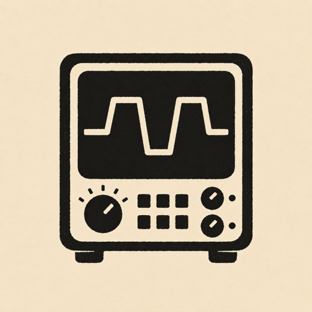

<p align="center">
  
</p>

<h1 align="center">Technician</h1>

<p align="center">
  <a href="https://github.com/jesseheady/technician/actions/workflows/ci.yml"></a>
  <a href="https://pkg.go.dev/github.com/jesseheady/technician"></a>
  <a href="https://goreportcard.com/report/github.com/jesseheady/technician"></a>
  <a href="https://github.com/jesseheady/technician/releases"></a>
  <a href="LICENSE"></a>
</p>

A single Go binary that checks your infrastructure over the network. Thirteen check types (HTTP, TCP, UDP, DNS, ICMP, gRPC, NTP, TLS, SMTP, traceroute, BGP, domain expiry, Playwright), Prometheus-native metrics, OTLP traces, performance budgets for CI, and Grafana dashboards included. Deploy one worker per region, point Prometheus at them, done.

**What this is not:** Technician is not a fleet agent, service discovery tool, or alerting engine. It does not auto-discover targets, manage remote agents, or replace your existing alerting pipeline. One binary, deployed per region, runs scheduled checks and exposes Prometheus metrics — that's the scope.

## What it does

- **Scheduled checks** — HTTP (with full httptrace timing: DNS, TLS, connect, TTFB, transfer), SMTP (mail server connectivity), traceroute (mtr), and browser (Playwright with Core Web Vitals and HAR recording).
- **Prometheus metrics** — 29 metrics (28 gauges + 1 counter) covering uptime, latency breakdowns, Web Vitals, HAR resource analysis, and budget violations. Exposed on `/metrics`.
- **Blackbox-compatible `/probe` endpoint** — Accepts `?target=&module=` queries so Prometheus can scrape ad-hoc probe targets via relabeling, the same contract as [prometheus/blackbox_exporter](https://github.com/prometheus/blackbox_exporter).
- **OTLP traces** — One span per check run with timing attributes and HAR entries as span events.
- **Performance budgets** — Define thresholds (duration, TTFB, LCP, INP, CLS, etc.) in YAML. The `validate` command runs all checks, evaluates budgets, and exits 0/1 for CI. Reporters: text, JSON, GitHub Actions annotations.
- **Grafana dashboards** — Five pre-built dashboards (uptime overview, performance vitals, HTTP timing, HAR analysis, budget violations) with Prometheus provisioning configs.

## Architecture


## Install

**Release binary** (linux/darwin, amd64/arm64) — see [Releases](https://github.com/jesseheady/technician/releases) for the latest version:

```bash
VERSION=v0.1.0
curl -fsSL "https://github.com/jesseheady/technician/releases/download/${VERSION}/technician-linux-amd64.tar.gz" | tar xz
./technician --help
```

**Container image** (multi-arch, from GitHub Container Registry):

```bash
docker pull ghcr.io/jesseheady/technician:latest
docker run --rm ghcr.io/jesseheady/technician:latest --help
```

**From source** (Go 1.26+):

```bash
go install github.com/jesseheady/technician@latest
```

## Quick start

**Minimal (Go binary only):**

```bash
go run . worker --config config/technician.yml
```

Metrics at [http://localhost:9590/metrics](http://localhost:9590/metrics), health at [http://localhost:9590/health](http://localhost:9590/health).

**Full stack (Technician + Prometheus + Grafana):**

```bash
cp -r examples/ config/   # first time
docker compose up
```

- Technician: port 9590
- Prometheus: [http://localhost:9090](http://localhost:9090)
- Grafana: [http://localhost:3000](http://localhost:3000) (admin / admin)

`docker compose up` builds Technician from local source. To pull the published image `ghcr.io/jesseheady/technician` instead, add the production overlay: `docker compose -f docker-compose.yml -f docker-compose.prod.yml up`. Works on macOS, Linux, and WSL. See [getting started](docs/getting-started.md) for the evaluate / contribute / operate paths.

## Commands

| Command | Purpose |
|---------|---------|
| `technician worker` | Long-running worker: scheduled checks + metrics server |
| `technician check --name <name>` | Run a single check (debugging) |
| `technician serve` | Metrics server only (no scheduling) |
| `technician validate` | Run all checks, check budgets, exit 0/1 (CI) |

Flags: `--config` / `-c` (default `technician.yml`), `--origin` (or `ORIGIN_ID` env), `--verbose` / `-v`.

## Configuration

- **Main config** — `technician.yml`: service name, origins (id, city, country, platform, labels), metrics listen address, artifact storage, Playwright mode.
- **Checks** — `checks.yml`: a single YAML list of all check definitions with name, type, target, schedule (cron), timeout, and retry policy. Supports all 13 check types (HTTP, TCP, UDP, DNS, ICMP, gRPC, NTP, TLS, SMTP, traceroute, BGP, domain expiry, Playwright). Alternatively, split into multiple files under a `checks/` directory — Technician merges them automatically.
- **Budgets** — Optional `budgets.yml` with per-check thresholds for `validate`.
- **Stability** — All checks support `retry` (count, backoff, delay) to absorb transient failures. Native webhooks require 3 consecutive failures before firing `check_down`. See [alerting](docs/alerting.md) for details.
- All YAML files support `${ENV_VAR}` expansion.

See [examples/](examples/) for reference configs. Copy to `config/` and customise for your targets.

## Deployment

| Target | Check support | Notes |
|--------|--------------|-------|
| **VPS / VM** | All (HTTP, SMTP, traceroute, browser) | Go binary + mtr + Node.js/Playwright. Prometheus scrapes `/metrics`. |
| **Docker / ECS** | All | Use the included Dockerfile. Multi-stage: Go builder + Node.js runtime with Playwright Chromium. |
| **AWS Lambda** | HTTP, SMTP (container image) | Regional Lambda with container image runs the full Go binary. No raw sockets for mtr. |
| **Cloudflare Workers** | HTTP only | JS/TS adapter needed (no Go binary, no subprocesses). See [proposal](docs/proposals/cloudflare-workers.md). |
| **Lambda@Edge** | HTTP only | Node.js/Python only. Lightweight HTTP check adapter. |

For VPC deployments with central Prometheus and Grafana, see [Central Prometheus and Grafana](docs/architecture/central-prometheus-grafana.md).

## Why Prometheus

Technician is built around Prometheus pull-based scraping because:

- **Self-hosted and open source** — No vendor lock-in. Runs in your VPC alongside the workers it scrapes.
- **Pull model fits long-lived workers** — Each Technician instance exposes `/metrics`; Prometheus scrapes them on an interval. No push infrastructure needed for VPS/container deployments.
- **Blackbox-exporter compatibility** — The `/probe` endpoint lets Prometheus drive ad-hoc checks with its native relabeling, the same pattern used across the Prometheus ecosystem.
- **Grafana integration** — Dashboards and alert rules are included and work immediately.

**When you might not need Technician:**
- If "is it up?" from managed infra is enough, consider **Route 53 Health Checks** or **Cloudflare Health Checks** — no custom code to maintain.
- If you want AWS-native synthetic monitoring with CloudWatch metrics, **CloudWatch Synthetics (Canaries)** overlaps heavily with what Technician does.
- If your org standardizes on a managed observability platform (Datadog, New Relic, etc.), Technician's OTLP export can bridge the gap, but those platforms have their own synthetic monitoring products.

## Documentation

- [Getting started](docs/getting-started.md) — Three onboarding paths (evaluate via Docker, contribute via `init.sh`, run in production), prerequisites, and check configuration.
- [Architecture: Central Prometheus and Grafana](docs/architecture/central-prometheus-grafana.md) — VPC deployment, scrape config, edge push strategies.
- [Proposal: Cloudflare Workers](docs/proposals/cloudflare-workers.md) — Edge check runners on Workers and Lambda.
- [Proposal: Site identifiers at the edge](docs/proposals/site-identifiers-edge.md) — How to identify check location in serverless environments.
- [Testing and E2E](docs/testing-and-e2e.md) — Test guide.
- [Core Web Vitals](docs/core-web-vitals.md) — LCP, INP, CLS thresholds and measurement.
- [Roadmap](docs/roadmap.md) — Planned work: Lambda adapter, Cloudflare Workers adapter, incomplete features.
- [Migrating between versions](docs/migrating.md) — Breaking changes, label renames, and cutover steps.
- [AGENTS.md](AGENTS.md) — Architecture reference and conventions for contributors.

## Acknowledgments

Inspired by [Upright](https://github.com/basecamp/upright), [Gatus](https://github.com/TwiN/gatus), [OpenStatus](https://github.com/openstatusHQ/openstatus), and [UptimeRobot](https://uptimerobot.com). Each inspired aspects of Technician's design. Technician is an independent implementation of synthetic monitoring in Go.

## Development

```bash
go test ./...
go vet ./...
go run . worker --config config/technician.yml
```

After changing check configs or `technician.yml` (no rebuild needed):

```bash
docker compose up -d --force-recreate technician
```

> Use `--force-recreate`, not `restart`. Config files are bind-mounted individually, and editors that save via write-temp-and-rename swap the file's inode — a running container (and `docker compose restart`) can keep viewing the old version on Docker Desktop. `--force-recreate` re-establishes the mount against the current file.

After changing Go source code (rebuild required):

```bash
docker compose build technician && docker compose up
```

## Contributing

See [CONTRIBUTING.md](CONTRIBUTING.md) for setup, code style, pre-commit hooks, and PR guidelines.

## License

Technician is licensed under the [MIT License](LICENSE).

Bundled third-party dependencies are permissively licensed (Apache-2.0, MIT, BSD); their notices are generated at build time and ship with binary and container distributions as `THIRD_PARTY_LICENSES.txt`.
