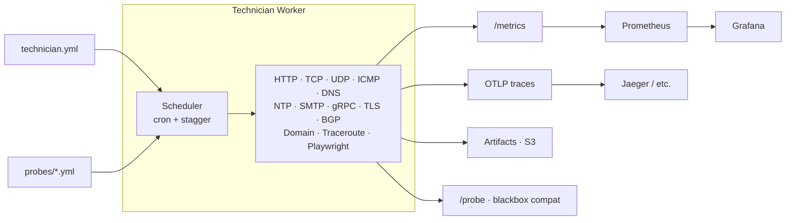

# Technician

A single Go binary that probes your infrastructure over the network. Thirteen probe types (HTTP, TCP, UDP, DNS, ICMP, gRPC, NTP, TLS, SMTP, traceroute, BGP, domain expiry, Playwright), Prometheus-native metrics, OTLP traces, performance budgets for CI, and Grafana dashboards included. Deploy one worker per region, point Prometheus at them, done.

## What it does

- **Scheduled probes** — HTTP (with full httptrace timing: DNS, TLS, connect, TTFB, transfer), SMTP (mail server connectivity), traceroute (mtr), and browser (Playwright with Core Web Vitals and HAR recording).
- **Prometheus metrics** — 20 gauges covering uptime, latency breakdowns, Web Vitals, HAR resource analysis, and budget violations. Exposed on `/metrics`.
- **Blackbox-compatible `/probe` endpoint** — Accepts `?target=&module=` queries so Prometheus can scrape ad-hoc probe targets via relabeling, the same contract as [prometheus/blackbox_exporter](https://github.com/prometheus/blackbox_exporter).
- **OTLP traces** — One span per probe run with timing attributes and HAR entries as span events.
- **Performance budgets** — Define thresholds (duration, TTFB, LCP, INP, CLS, etc.) in YAML. The `validate` command runs all probes, evaluates budgets, and exits 0/1 for CI. Reporters: text, JSON, GitHub Actions annotations.
- **Grafana dashboards** — Five pre-built dashboards (uptime overview, performance vitals, HTTP timing, HAR analysis, budget violations) with Prometheus provisioning configs.

## Architecture



## Quick start

**Minimal (Go binary only):**

```bash
go run . worker --config config/technician.yml
```

Metrics at [http://localhost:9590/metrics](http://localhost:9590/metrics), health at [http://localhost:9590/health](http://localhost:9590/health).

**Full stack (Technician + Prometheus + Grafana):**

```bash
docker compose up
```

- Technician: port 9590
- Prometheus: [http://localhost:9090](http://localhost:9090)
- Grafana: [http://localhost:3000](http://localhost:3000) (admin / admin)

## Commands

| Command | Purpose |
|---------|---------|
| `technician worker` | Long-running worker: scheduled probes + metrics server |
| `technician probe --name <name>` | Run a single probe (debugging) |
| `technician serve` | Metrics server only (no scheduling) |
| `technician validate` | Run all probes, check budgets, exit 0/1 (CI) |

Flags: `--config` / `-c` (default `technician.yml`), `--site` (or `SITE_CODE` env), `--verbose` / `-v`.

## Configuration

- **Main config** — `technician.yml`: service name, sites (code, city, country, location_hash, infra_provider), metrics listen address, artifact storage, Playwright mode.
- **Probes** — `probes/http.yml`, `probes/tcp.yml`, `probes/udp.yml`, `probes/dns.yml`, `probes/icmp.yml`, `probes/grpc.yml`, `probes/ntp.yml`, `probes/tls.yml`, `probes/smtp.yml`, `probes/traceroute.yml`, `probes/bgp.yml`, `probes/domain_expiry.yml`, `probes/playwright/playwright.yml`. Each file is a list of probe definitions with name, target, schedule (cron), timeout, and retry policy.
- **Budgets** — Optional `budgets.yml` with per-probe thresholds for `validate`.
- **Stability** — All probes support `retry` (count, backoff, delay) to absorb transient failures. Native webhooks require 3 consecutive failures before firing `probe_down`. See [alerting](docs/alerting.md) for details.
- All YAML files support `${ENV_VAR}` expansion.

See [examples/](examples/) for reference configs. Copy to `config/` and customise for your targets.

## Deployment

| Target | Probe support | Notes |
|--------|--------------|-------|
| **VPS / VM** | All (HTTP, SMTP, traceroute, browser) | Go binary + mtr + Node.js/Playwright. Prometheus scrapes `/metrics`. |
| **Docker / ECS** | All | Use the included Dockerfile. Multi-stage: Go builder + Node.js runtime with Playwright Chromium. |
| **AWS Lambda** | HTTP, SMTP (container image) | Regional Lambda with container image runs the full Go binary. No raw sockets for mtr. |
| **Cloudflare Workers** | HTTP only | JS/TS adapter needed (no Go binary, no subprocesses). See [proposal](docs/proposals/cloudflare-workers.md). |
| **Lambda@Edge** | HTTP only | Node.js/Python only. Lightweight HTTP probe adapter. |

For VPC deployments with central Prometheus and Grafana, see [Central Prometheus and Grafana](docs/architecture/central-prometheus-grafana.md).

## Why Prometheus

Technician is built around Prometheus pull-based scraping because:

- **Self-hosted and open source** — No vendor lock-in. Runs in your VPC alongside the workers it scrapes.
- **Pull model fits long-lived workers** — Each Technician instance exposes `/metrics`; Prometheus scrapes them on an interval. No push infrastructure needed for VPS/container deployments.
- **Blackbox-exporter compatibility** — The `/probe` endpoint lets Prometheus drive ad-hoc probes with its native relabeling, the same pattern used across the Prometheus ecosystem.
- **Grafana integration** — Dashboards and alert rules are included and work immediately.

**When you might not need Technician:**
- If "is it up?" from managed infra is enough, consider **Route 53 Health Checks** or **Cloudflare Health Checks** — no custom code to maintain.
- If you want AWS-native synthetic monitoring with CloudWatch metrics, **CloudWatch Synthetics (Canaries)** overlaps heavily with what Technician does.
- If your org standardizes on a managed observability platform (Datadog, New Relic, etc.), Technician's OTLP export can bridge the gap, but those platforms have their own synthetic monitoring products.

## Documentation

- [Getting started](docs/getting-started.md) — Prerequisites, Mac init script, running the worker and full stack.
- [Architecture: Central Prometheus and Grafana](docs/architecture/central-prometheus-grafana.md) — VPC deployment, scrape config, edge push strategies.
- [Proposal: Cloudflare Workers](docs/proposals/cloudflare-workers.md) — Edge probe runners on Workers and Lambda.
- [Proposal: Site identifiers at the edge](docs/proposals/site-identifiers-edge.md) — How to identify probe location in serverless environments.
- [Testing and E2E](docs/testing-and-e2e.md) — Test guide.
- [Core Web Vitals](docs/core-web-vitals.md) — LCP, INP, CLS thresholds and measurement.
- [Roadmap](docs/roadmap.md) — Planned work: Lambda adapter, Cloudflare Workers adapter, incomplete features.
- [Migrating between versions](docs/migrating.md) — Breaking changes, label renames, and cutover steps.
- [AGENTS.md](AGENTS.md) — Architecture reference and conventions for contributors.

## Acknowledgments

Inspired by [Upright](https://github.com/basecamp/upright), [Gatus](https://github.com/TwiN/gatus), [OpenStatus](https://github.com/openstatusHQ/openstatus), and [UptimeRobot](https://uptimerobot.com). Each inspired aspects of Technician's design. Technician is an independent implementation of synthetic monitoring in Go.

## Development

```bash
go test ./...
go vet ./...
go run . worker --config config/technician.yml
```

After changing probe configs or `technician.yml` (no rebuild needed):

```bash
docker compose restart technician
```

After changing Go source code (rebuild required):

```bash
docker compose build technician && docker compose up
```

## Contributing

See [CONTRIBUTING.md](CONTRIBUTING.md) for setup, code style, pre-commit hooks, and PR guidelines.
