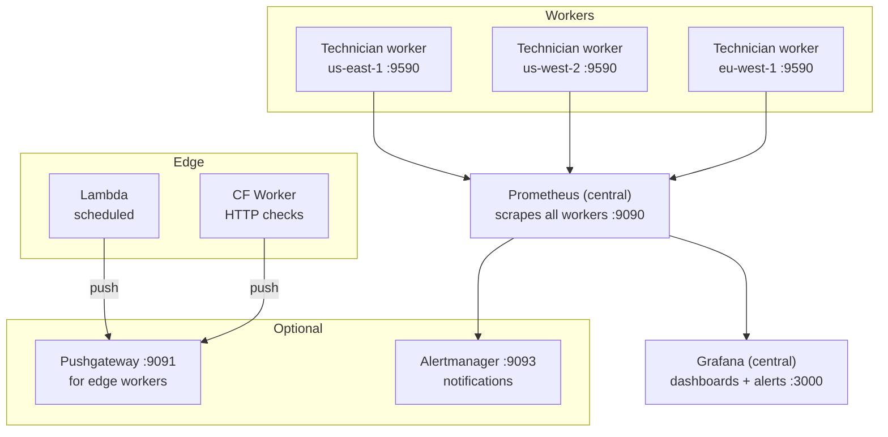
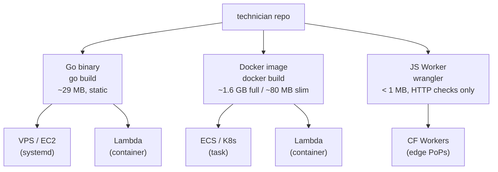
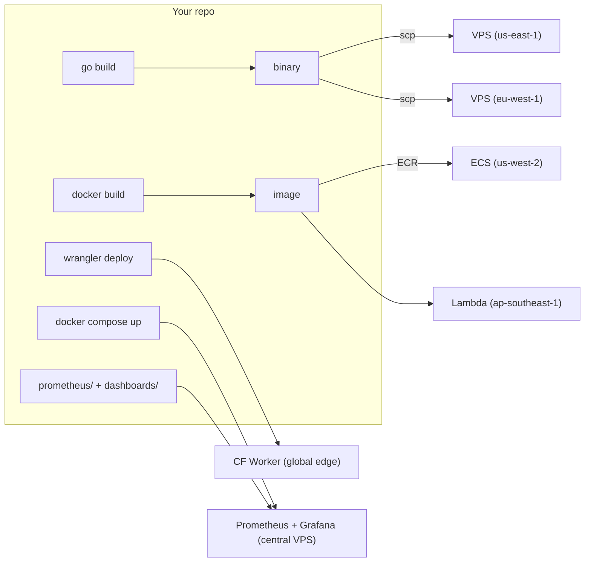

# Deployment sizing

Resource requirements, deployment topology, and scaling considerations.

## Context

Technician is a static Go binary (29 MB, stripped) with no database, no runtime interpreter, and no background job system. Checks run as goroutines inside a single process. The main variable is whether you include **Playwright browser checks**, which require Node.js and Chromium.

## Measured resource usage

Numbers below were measured with 34 checks active across all 13 check types (6 HTTP, 3 TCP, 2 UDP, 4 DNS, 2 ICMP, 3 NTP, 4 TLS, 1 SMTP, 2 traceroute, 2 BGP, 2 domain expiry, 3 Playwright) on a Docker Compose stack, exporting 35 Prometheus metric families.

### Runtime memory

| Component | RSS | Notes |
|-----------|-----|-------|
| Technician (Go process) | ~35 MB | 34 checks (13 types), status store, Prometheus registry |
| Prometheus | ~150 MB | 90-day retention, scraping one target |
| Grafana | ~215 MB | 6 provisioned dashboards, anonymous viewer |
| **Full stack total** | **~425 MB** | |

### Image / disk sizes

| Component | Size | Breakdown |
|-----------|------|-----------|
| Go binary | 29 MB | `CGO_ENABLED=0`, `-ldflags="-s -w"` |
| Docker image (with Playwright) | 1.63 GB | Chromium 602 MB + headless shell 323 MB + Node.js base + system deps |
| Docker image (without Playwright) | ~80 MB | Alpine or distroless base + Go binary + mtr + ca-certificates |
| Prometheus image | ~390 MB | |
| Grafana image | ~1.0 GB | |

### Playwright overhead

Each Playwright check launches a separate Chromium instance via Node.js:

| Metric | Value |
|--------|-------|
| Node.js baseline RSS | ~40 MB |
| Chromium per instance | ~150–300 MB |
| HAR + video artifacts | 1–10 MB per run (disk) |
| Cold start (first check) | ~2–3 s |
| Warm check execution | ~3–8 s depending on page complexity |

Chromium instances are not pooled — each check invocation launches and closes a browser. The `max_browsers` setting (default 2) caps concurrent instances via a semaphore. Checks queue for a slot and fail with an infra error if their timeout expires while waiting. The container **must** run an init process (e.g. `init: true` in Compose) to reap exited Chromium children — without it, zombie processes accumulate and leak kernel memory. See [Playwright scaling](playwright-scaling.md) for detailed resource projections and dedicated runner architecture.

### TLS check overhead

The TLS check is minimal: a single outbound TCP connection + TLS handshake per check, with no subprocess or external dependency. Memory overhead is negligible (~1 KB per check run). Resource usage is comparable to a TCP check with TLS enabled.

## Performance optimizations

Technician includes several layers of optimization to minimize resource usage and maximize stability at scale.

### Network & I/O

| Optimization | Location | Detail |
|-------------|----------|--------|
| **HTTP client pooling** | `internal/check/http.go` | Shared `http.Client` per TLS/redirect config. `MaxIdleConns=100`, `MaxIdleConnsPerHost=5`, `IdleConnTimeout=90s`. Eliminates per-check TCP+TLS handshake overhead. |
| **gRPC connection pooling** | `internal/check/grpc.go` | Cached connections keyed by `(host, tls, skipTLS)`. Connections reused across check cycles. |
| **DNS resolver caching** | `internal/check/dns.go` | One `net.Resolver` per DNS server, using `PreferGo` mode with custom UDP dialer. Avoids creating a resolver per check run. |
| **Gzip response compression** | `internal/server/gzip.go` | `sync.Pool`-backed gzip middleware on all responses except `/metrics` and `/health` (which Prometheus and health checks prefer uncompressed). |
| **ETag / conditional responses** | `internal/status/handler.go` | SHA256-based ETag on `/` and `/api/status`. Returns `304 Not Modified` when content hasn't changed, saving bandwidth on the 10s auto-refresh cycle. |
| **HTTP server timeouts** | `cmd/worker.go` | `ReadTimeout=15s`, `WriteTimeout=30s`, `IdleTimeout=60s`, `MaxHeaderBytes=1MB`. Prevents slow-client resource exhaustion. |

### CPU & memory

| Optimization | Location | Detail |
|-------------|----------|--------|
| **Compiled regex cache** | `internal/check/http.go` | `sync.Map` caches compiled `*regexp.Regexp` for HTTP body/header assertions. Lock-free reads after first compile. |
| **Status snapshot caching** | `internal/status/store.go` | 2-second TTL cache on `Snapshot()`. Absorbs rapid page refreshes and the 10s auto-refresh without recomputing percentiles. |
| **Circular ring buffer** | `internal/status/store.go` | Fixed 90-entry ring per check with `head`/`full` pointer. No slice reallocation or reslicing on overflow. |
| **Template output buffering** | `internal/status/handler.go` | Status page HTML rendered to buffer before writing to `ResponseWriter`, avoiding partial writes on error. |
| **TCP read buffer limit** | `internal/check/tcp.go` | Max read size bounded to prevent memory exhaustion from large responses on banner checks. |

### Alerting stability

| Optimization | Location | Detail |
|-------------|----------|--------|
| **Check-level retries** | `internal/scheduler/scheduler.go` | Configurable `count`, `backoff` (none/linear/exponential), `delay` per check. Absorbs transient failures before reporting. |
| **Consecutive-failure threshold** | `internal/notify/notify.go` | 3 consecutive failures required before `check_down` fires. Single success resets the counter. |
| **InfraError exclusion** | `internal/notify/notify.go` | Infrastructure errors (DNS resolution, connection refused) excluded from failure counting — prevents transient infra blips from triggering alerts. |
| **Webhook concurrency limit** | `internal/notify/notify.go` | Semaphore caps outbound webhook sends at 4 concurrent goroutines. Prevents thundering herd on mass failure. |
| **Per-check cooldown** | `internal/notify/notify.go` | Deduplicates repeated notifications for the same check+event within the configured cooldown window (default 5m). |

### Prometheus & metrics

| Optimization | Location | Detail |
|-------------|----------|--------|
| **Cardinality guard** | `internal/metrics/prometheus.go` | `maxProbeCardinality=500` — silently drops new check names beyond the limit. Prevents label explosion from degrading Prometheus. |
| **Stagger delay** | `internal/scheduler/stagger.go` | FNV-32a hash-based deterministic delay (0–10s) per check. Spreads check execution to avoid metric spikes and network bursts. |

### Docker & CI

| Optimization | Location | Detail |
|-------------|----------|--------|
| **Multi-stage build** | `Dockerfile` | Go builder → `node:22-slim` runtime. Binary stripped (`-s -w`), CGO disabled. |
| **Layer caching** | `.github/workflows/` | Docker buildx with GitHub Actions cache. |
| **Health checks** | `docker-compose.yml` | All services (Technician, Prometheus, Alertmanager, Grafana) have health checks with start periods, enabling dependency ordering. |
| **Security scanning** | CI | `govulncheck` in CI pipeline. |

## Deployment topology

Technician is designed as a set of independent components. You can run everything on one box or spread across multiple hosts. Here's the full picture:



### Component roles

| Component | Role | Required? | Runs where |
|-----------|------|-----------|------------|
| **Technician worker** | Runs checks on a schedule, exposes `/metrics` and status page | Yes (1+ instances) | VPS, EC2, ECS, Kubernetes |
| **Prometheus** | Scrapes workers, stores time-series, evaluates alert rules | Yes (1 instance) | Central host or managed service |
| **Grafana** | Dashboards, historical views, alert notifications | Recommended (1 instance) | Central host or Grafana Cloud |
| **Alertmanager** | Routes alerts to Slack, PagerDuty, email, etc. | Optional | Alongside Prometheus |
| **Pushgateway** | Receives metrics from edge/serverless checks | Only for edge deploys | Central, reachable from edge |

### What should run together vs. separately

**Single-box deploy (development, small-scale)**

All components on one host. This is the `docker compose up` default:

- Technician worker + Prometheus + Grafana on one machine
- Fine for monitoring a handful of sites from one vantage point
- The status page at `:9590/` gives real-time view; Grafana at `:3000` gives historical

**Production deploy (multi-region)**

Separate concerns for reliability and geographic coverage:

- **Workers**: One per region/vantage point. Each runs independently with its own `ORIGIN_ID`. If a worker goes down, other regions keep probing. Workers are stateless — no data loss on restart (metrics are scraped by Prometheus before they're lost).
- **Prometheus + Grafana**: Central, on a single host or managed service. Should not run on the same box as a worker — if the worker's host dies, you lose your monitoring history.
- **Alertmanager**: Alongside Prometheus. Fires notifications when `CheckFailing` or `BudgetViolation` rules trigger.

**Why workers should be separate from the central stack:**

1. **Independence** — A worker failure shouldn't take down dashboards. A Grafana restart shouldn't stop probing.
2. **Geography** — Workers need to be in the regions you're probing from. Prometheus/Grafana only need to be reachable.
3. **Resource isolation** — Workers are tiny (~18 MB). Grafana is heavy (300 MB). Different scaling profiles.

## Build artifacts and deploy flow

One repo produces multiple deployment targets. Here's what ships where and how:



### What each target runs

| Target | Binary / image | Subcommand | Metrics flow | Status page |
|--------|---------------|------------|--------------|-------------|
| **VPS / EC2** | Go binary or Docker image | `technician worker` | Prometheus scrapes `:9590/metrics` | Built-in at `:9590/` |
| **ECS / Kubernetes** | Docker image | `technician worker` | Prometheus scrapes via service discovery | Built-in at `:9590/` |
| **Lambda (scheduled)** | Go binary (zip) or Docker image | `technician validate` or Lambda handler (planned) | Push to Pushgateway or remote-write | None (headless) |
| **Cloudflare Worker** | JS bundle (planned) | N/A (JS runtime) | Push to Pushgateway | None (headless) |

### How to deploy each target

**VPS (any provider)**

The simplest path. A single static binary, no Docker required.

```bash
# Build
CGO_ENABLED=0 go build -ldflags="-s -w" -o technician .

# Copy to server
scp technician yourserver:/usr/local/bin/
scp -r config/ yourserver:/etc/technician/

# Create data directory for status persistence
ssh yourserver 'mkdir -p /var/lib/technician'

# Run (or use systemd — see below)
ssh yourserver 'ORIGIN_ID=us-east-1 technician worker --config /etc/technician/technician.yml'
```

**What you get with just the worker (no Prometheus/Grafana):**

| Feature | Available? |
|---------|-----------|
| Status page at `:9590/` | Yes — real-time check status, history bars, latency percentiles |
| JSON API at `/api/status` | Yes — for external integrations or a custom status page |
| Prometheus metrics at `/metrics` | Yes — ready to scrape whenever you add Prometheus |
| Native webhook alerts (Discord, Slack, generic) | Yes — fires on check state transitions, cert expiry, and budget violations with severity routing (warn/crit to different channels) |
| Blackbox-exporter compat at `/probe` | Yes |
| Grafana dashboards | No — requires Prometheus + Grafana |
| Historical data beyond ~45 min | No — the in-memory ring buffer holds 90 entries per check |
| Alert rules (CheckFailing, BudgetViolation) | No — requires Prometheus |

This is a valid production deployment for teams that just need uptime monitoring with webhook alerts. The status page and `/api/status` endpoint work independently. Add Prometheus + Grafana later when you want historical trends and dashboards — the worker is already exporting metrics.

**systemd unit file:**

```ini
[Unit]
Description=Technician check runner
After=network-online.target
Wants=network-online.target

[Service]
Type=simple
ExecStart=/usr/local/bin/technician worker --config /etc/technician/technician.yml
Environment=ORIGIN_ID=us-east-1
Restart=always
RestartSec=5
WorkingDirectory=/var/lib/technician

# Security hardening
NoNewPrivileges=true
ProtectSystem=strict
ProtectHome=true
ReadWritePaths=/var/lib/technician
PrivateTmp=true

[Install]
WantedBy=multi-user.target
```

```bash
# Install and start
sudo cp technician.service /etc/systemd/system/
sudo systemctl daemon-reload
sudo systemctl enable --now technician
sudo journalctl -u technician -f  # tail logs
```

For Playwright checks, you'd also need Node.js and Chromium on the host — in that case, Docker is easier. For traceroute checks, install mtr (`apt install mtr-tiny`) and note that mtr requires root for raw sockets (the systemd unit runs as root by default; add `AmbientCapabilities=CAP_NET_RAW` if you add a `User=` directive). For NTP checks, ensure outbound UDP port 123 is open.

**Docker / ECS / Kubernetes**

```bash
# Build image
docker build -t technician .

# Push to registry
docker tag technician your-registry/technician:latest
docker push your-registry/technician:latest

# Deploy per region (each with its own ORIGIN_ID)
# ECS: one service per region, env ORIGIN_ID=us-east-1
# K8s: one Deployment per region, env ORIGIN_ID=eu-west-1
```

Each instance runs `technician worker` (the Dockerfile default). Prometheus discovers them via DNS, ECS service discovery, or Kubernetes service endpoints.

**Lambda (planned)**

The Go binary runs in Lambda as a container image or zip deploy. Two invocation models:

1. **EventBridge schedule** triggers Lambda every N minutes. Lambda runs all checks once (`technician validate`), pushes results to Pushgateway, exits.
2. **Per-check invocation** — EventBridge triggers a separate Lambda per check. More granular, better cold-start isolation.

Lambda can't be scraped (no long-lived process), so metrics must be **pushed**:

```
EventBridge (cron) → Lambda → run checks → push to Pushgateway → Prometheus scrapes Pushgateway
```

See [Central Prometheus and Grafana](architecture/central-prometheus-grafana.md) for push configuration.

**Cloudflare Workers (planned)**

A separate JS/TS implementation under `workers/cf/` that mirrors the `/probe?target=&module=` contract. Deployed via Wrangler:

```
Cron Trigger → Worker → HTTP check → push result to Pushgateway
```

Workers run at Cloudflare's edge PoPs — you get geographic diversity without managing servers. The Worker is not the Go binary; it's a lightweight JS check that speaks the same metrics format.

See [Cloudflare Workers proposal](proposals/cloudflare-workers.md) for the full design.

### Where the control center lives

The **central dashboard** is separate from all check workers:

| Piece | What it does | Where it runs |
|-------|-------------|---------------|
| **Prometheus** | Scrapes all VPS/ECS workers. Scrapes Pushgateway for Lambda/edge results. Stores all time-series. Evaluates alert rules. | One central host — a VPS, EC2 instance, or managed Prometheus service. |
| **Grafana** | Queries Prometheus. Renders dashboards (uptime, timing, vitals, budgets). Sends alert notifications. This is the "control center." | Same host as Prometheus, or Grafana Cloud (free tier available). |
| **Pushgateway** | Receives metric pushes from Lambda and Cloudflare Workers. Prometheus scrapes it like any other target. | Same host as Prometheus (port 9091). |
| **Alertmanager** | Routes alerts from Prometheus rules to Slack, PagerDuty, email, webhooks. | Same host as Prometheus (port 9093). |

The built-in status page at each worker's `:9590/` is a **per-worker view** — it shows what that one worker sees in real time. Grafana is the aggregated view across all workers and regions. For a public-facing status page, use Grafana's anonymous viewer role or a static page that queries the Prometheus API.

### Putting it all together

A complete multi-region deployment from this repo:



All check results — from VPS workers, ECS tasks, Lambda functions, and Cloudflare Workers — end up in the same central Prometheus. Grafana queries that one Prometheus and shows everything on the same dashboards, filterable by `region` and check type.

## Using managed services

Technician is designed to work with self-hosted or managed infrastructure. Here's what's configurable today and what needs work.

### What's configurable now

| Dependency | Config field | Options |
|------------|-------------|---------|
| **OTLP tracing** | `metrics.otel.endpoint` | Any OTLP-compatible collector — AWS X-Ray (via ADOT Collector), Datadog, Honeycomb, Jaeger, etc. Leave empty to disable. |
| **Artifact storage** | `artifacts.driver` | `local` (disk), `s3` (any S3-compatible store — AWS S3, MinIO, R2), or `none`. |
| **Prometheus scrape** | `metrics.prometheus.listen` | Technician exposes `/metrics` on this address. Any Prometheus-compatible scraper can collect from it. |

### AWS Managed Prometheus (AMP)

AMP uses remote-write ingestion, not pull-based scraping. Three ways to get metrics from Technician into AMP:

**Option A: AMP managed scraper (simplest for ECS/EC2)**

AMP can scrape ECS and EC2 targets natively via its managed scraper feature. Configure a scrape config in AMP that discovers Technician services by tag or service discovery. No sidecar, no code changes — Technician just exposes `/metrics` as usual.

**Option B: Sidecar agent (works anywhere)**

Run Grafana Alloy, Prometheus in agent mode, or AWS Distro for OpenTelemetry (ADOT) alongside each Technician worker. The agent scrapes local `:9590/metrics` and remote-writes to AMP.

Example with Grafana Alloy:

```hcl
prometheus.scrape "technician" {
  targets    = [{"__address__" = "localhost:9590"}]
  forward_to = [prometheus.remote_write.amp.receiver]
}

prometheus.remote_write "amp" {
  endpoint {
    url = "https://aps-workspaces.us-east-1.amazonaws.com/workspaces/ws-xxx/api/v1/remote_write"
    sigv4 { region = "us-east-1" }
  }
}
```

**Option C: Built-in remote-write (planned)**

A future enhancement would add native Prometheus remote-write to Technician itself, configured via `metrics.prometheus.remote_write_url` in `technician.yml`. This eliminates the sidecar for push-based environments (Lambda, edge, or when AMP managed scraper isn't available).

### AWS Managed Grafana (AMG)

No code changes needed. Configure AMG with a Prometheus datasource pointing at your AMP workspace, then import the dashboard JSONs from `dashboards/`. The dashboards use standard PromQL and template variables (`region`, `check`, and for browser dashboards `network` and `device`) that work identically with AMP.

### Alerting

Technician supports two complementary alerting layers:

**Central alerting** — alerts evaluated by Prometheus or Grafana against scraped metrics. Supports grouping, silencing, escalation, and dashboards.

| Approach | How |
|----------|-----|
| **Prometheus alert rules** | Deploy `prometheus/rules.yml` to AMP or self-hosted Prometheus. Rules like `CheckFailing` and `BudgetViolation` fire as native Prometheus alerts. |
| **Grafana alerting** | Define alert rules in AMG/Grafana that query AMP. Route to SNS, PagerDuty, Slack, etc. via Grafana contact points. |
| **Alertmanager** | Self-hosted Alertmanager receives alerts from Prometheus rules. Routes to Slack, PagerDuty, email, webhooks. |

**Native webhooks** — webhooks fired directly from the Technician worker on check state changes (up→down, down→up) and budget violations. No dependency on the central stack being reachable.

| | Central (Prometheus/Grafana) | Native (Technician worker) |
|--|------------------------------|--------------------------|
| **Latency** | 30–60s (scrape interval + rule eval) | Immediate (fires in the check goroutine) |
| **Deduplication** | Alertmanager groups, deduplicates, silences | Fire on state change only, with per-check cooldown |
| **Dependency** | Requires Prometheus + Alertmanager/Grafana to be up | Zero — just an outbound HTTP POST |
| **Escalation** | Routes by severity, time-of-day, team | Not built-in (use central for complex routing) |
| **Works on Lambda/edge** | Only if metrics reach Prometheus in time | Yes — fires before the function exits |
| **Best for** | Alert management with grouping, silencing, escalation, history | "Check down" notifications that fire regardless of central stack health |

Native webhooks are configured in `technician.yml` under `webhooks` and support Discord, Slack, and generic HTTP endpoints. See [alerting.md](alerting.md) for configuration details and comparison of all three alerting strategies.

### Dependency map

Every external dependency Technician touches, and whether it can be swapped:

| Dependency | Bundled (docker compose) | Managed alternative | Config needed |
|------------|-------------------------|--------------------|----|
| Prometheus | `prom/prometheus` container | AMP, Grafana Cloud, Thanos, Mimir | Scrape config or remote-write agent |
| Grafana | `grafana/grafana` container | AMG, Grafana Cloud (free tier) | Datasource + dashboard import |
| Alertmanager | `prom/alertmanager` container | AMG alerting, SNS, PagerDuty via Grafana | `prometheus/alertmanager.yml` receivers; or contact point config in Grafana |
| Artifact storage | Local disk (`/tmp/technician/artifacts`) | S3, R2, MinIO | `artifacts.driver: s3` + bucket/region |
| OTLP tracing | None (disabled by default) | X-Ray (ADOT), Datadog, Honeycomb | `metrics.otel.endpoint` |
| DNS/network | Host resolver | Route 53, Cloudflare DNS | N/A (uses OS resolver) |

## Persistence and historical data

### Where data lives today

| Data | Store | Retention | Survives restart? |
|------|-------|-----------|-------------------|
| Real-time check status | In-memory ring buffer (90 results per check), persisted to JSON file every 60s. Daily backups retained 90 days. Snapshot cached 2s. | Depends on check interval: ~45 min at 30s, ~3 hours at 2min, ~7.5 hours at 5min | Yes (with Docker named volume or persistent disk). Falls back to most recent backup if main file is missing or corrupt. |
| Metrics time-series | Prometheus / AMP | Configurable (default 90 days in docker-compose, up to years) | Yes |
| Dashboards, uptime history, trends | Grafana querying Prometheus | As long as Prometheus retains the data | Yes |
| HAR files, screenshots, videos | Local disk or S3 | Configurable (`artifacts.retention`) | Yes (if S3) |
| Alert history | Alertmanager / Grafana | Depends on config | Yes |

### Storage model

All storage is bounded. No container grows without a configured limit or automatic pruning.

**Install footprint (day 0)**

| Container | Docker image | Named volume | Data at first boot |
|-----------|-------------|-------------|-------------------|
| Technician | 1.62 GB (with Playwright) / 80 MB (without) | `technician_data` | Empty `status.json` (~1 KB) |
| Prometheus | ~390 MB | `prometheus_data` | Empty TSDB WAL (~1 MB) |
| Grafana | ~1.0 GB | `grafana_data` | SQLite database (~5 MB) |
| Alertmanager | ~70 MB | `alertmanager_data` | Silence + notification log (~100 KB) |
| **Total** | **~3.1 GB** (with Playwright) | | |

**Steady-state growth (per day, 31 checks, 15s scrape interval)**

| Container | Daily growth | What grows | Pruning mechanism | Steady-state disk |
|-----------|-------------|------------|-------------------|-------------------|
| Technician | ~50 KB/day (backups) | Daily `status.json` backup | Auto-pruned at 90 days | ~4.5 MB backups + ~50 KB live |
| Technician (artifacts) | 0 MB (no video) – 500 MB/day (video on all Playwright checks) | HAR, video, screenshots | `artifacts.retention` (default 72h) | 0 – 1.5 GB |
| Prometheus | ~15–25 MB/day | TSDB blocks (371 series × 15s samples) | TSDB compaction + retention | ~1.4–2.3 GB at 90d retention |
| Grafana | < 1 MB/day | Alert state, session data | Internal SQLite vacuum | < 10 MB |
| Alertmanager | < 1 MB/day | Silence/nflog state | Internal compaction | < 5 MB |

**Maximum retention by data type**

| Data | Default retention | Configurable? | How to change |
|------|------------------|---------------|---------------|
| Check history (ring buffer) | 90 entries per check (~45 min at 30s, ~3h at 2min, ~7.5h at 5min) | No (compile-time) | Change `maxHistory` in `internal/status/store.go` |
| Status backups | 90 days | No (compile-time) | Change retention in `SaveBackup()` in `internal/status/store.go` |
| Playwright artifacts | 72h | Yes | `artifacts.retention` in `technician.yml` |
| Prometheus time-series | 90 days / 5 GB (whichever first) | Yes | `--storage.tsdb.retention.time` and `--storage.tsdb.retention.size` in `docker-compose.yml` Prometheus command |
| Grafana data | Indefinite (< 10 MB) | N/A | N/A |

**Scaling by check count (steady-state at 90-day retention)**

| Checks | Technician volume | Prometheus volume (90d) | Total disk (all containers) |
|--------|------------------|------------------------|-----------------------------|
| 10 | ~4 MB | ~600 MB | ~610 MB |
| 50 | ~18 MB | ~1.8 GB | ~1.8 GB |
| 100 | ~40 MB | ~3 GB | ~3 GB |
| 500 | ~200 MB | ~12 GB | ~12.2 GB |

*Prometheus storage scales linearly with retention — doubling retention doubles disk. Estimates assume ~12 series per check and 15s scrape interval. Technician estimates include 90 days of daily backups. Artifact storage excluded (depends on Playwright video config).*

**Recommended minimum disk by deployment**

| Deployment | Disk | Headroom for |
|------------|------|-------------|
| Dev / local Docker | 5 GB | 90d Prometheus retention, no artifacts |
| Production (no Playwright) | 5–10 GB | 90d Prometheus retention, 90d status backups |
| Production (with Playwright + video) | 10–20 GB | Artifact accumulation at 72h retention |
| 500+ checks | 20–50 GB | 90d Prometheus retention at high cardinality |

### Prometheus storage safeguards

The `docker-compose.yml` includes guards to prevent Prometheus from exhausting disk. These were added after an incident where the shared Docker VM disk filled up (from dangling images and build cache), causing Prometheus WAL writes to fail with "no space left on device" — all queries returned empty and historical data was lost.

| Flag | Value | Purpose |
|------|-------|---------|
| `--storage.tsdb.retention.time` | `90d` | Delete blocks older than 90 days |
| `--storage.tsdb.retention.size` | `5GB` | Hard cap on total block size — deletes oldest blocks when exceeded, even if younger than 90d |
| `--storage.tsdb.wal-compression` | (enabled) | Compresses WAL segments (~30–50% smaller), reducing peak disk usage |

When both time and size retention are set, Prometheus deletes data when **either** limit is breached (whichever comes first). Under normal load (31 checks, ~2 GB at 90d), the time limit applies. Under disk pressure, the size limit kicks in and evicts old blocks to stay under 5 GB.

**WAL is not bounded by `retention.size`** — the WAL holds the most recent ~2 hours of uncompacted data. For this workload (371 series at 15s scrape), the WAL stays under 200 MB. WAL compression reduces this further.

**Tuning `retention.size` for larger deployments:**

| Checks | 90d block size (est.) | Recommended `retention.size` |
|--------|----------------------|------------------------------|
| 10–50 | 0.6–1.8 GB | `5GB` (default in compose) |
| 100 | ~3 GB | `8GB` |
| 500 | ~12 GB | `25GB` |

**Alert rules:** `PrometheusStorageHigh` fires at 80% of the size cap. `PrometheusWALCorruptions` fires immediately on WAL corruption. Both require the `prometheus` self-scrape job in `prometheus.yml`.

**Docker disk management:** The Prometheus-level guards protect against TSDB growth, but the original incident was caused by Docker VM disk exhaustion from dangling images and build cache. To prevent recurrence: run `docker system prune --all --force` periodically, set Docker Desktop disk size above 20 GB, and add `docker builder prune --force` as a post-build step in CI.

### Status store scaling

The in-memory status store is persisted to a single JSON file (`status.json`) every 60 seconds. Daily backups are kept for 90 days. Snapshot results are cached in memory (2s TTL) to avoid recomputing percentiles on every page load.

**File size by check count** (at full 90-entry ring buffer per check):

| Checks | Snapshot size | 90 days of daily backups | Marshal/unmarshal |
|--------|--------------|------------------------|--------------------|
| 10 | ~40 KB | ~3.5 MB | < 1 ms |
| 100 | ~400 KB | ~35 MB | ~2–3 ms |
| 500 | ~2 MB | ~180 MB | ~10–15 ms |
| 1000 | ~4 MB | ~360 MB | ~20–30 ms |
| 5000 | ~20 MB | ~1.8 GB | ~100–150 ms |

**What to watch at scale:**

- **`Snapshot()` computation** — Sorts each check's entries for percentile calculation and averages timing data. At 1000 checks × 90 entries = 90K entries per snapshot. The 2s cache absorbs rapid page refreshes and the 10s auto-refresh, but a single computation still takes O(checks × entries). This is the first bottleneck.
- **`Save()` lock hold** — Copies all data under `RLock` before marshaling. At 1000+ checks the copy phase grows, adding latency to `Push()` calls contending for the write lock.
- **Full-file rewrite** — Every 60s save rewrites the entire file. At 20 MB+ this creates unnecessary I/O.

**Inflection points:**

| Scale | Status | Action |
|-------|--------|--------|
| < 100 checks | No concerns | JSON store is the right choice |
| 100–500 checks | Monitor marshal time in logs | Consider pre-computing percentiles on `Push()` instead of on `Snapshot()` |
| 500–1000 checks | Marshal + snapshot cost becomes measurable | Move to SQLite (see below) for append-only writes, indexed queries, no full-file rewrite |
| 1000+ checks | JSON is the wrong tool | SQLite or Prometheus API for historical data |

All backup storage fits comfortably on a minimal EBS volume at any realistic check count. S3 would only be relevant for cross-region archival or decoupling storage from the worker instance.

### Prometheus metrics cardinality

Each unique check name creates a set of Prometheus time-series (one per metric × site label combination). At scale, this can cause cardinality explosion — degrading Prometheus query performance and memory usage.

Technician enforces a default limit of **500 unique check names** for metrics recording. This is controlled by `maxProbeCardinality` in `internal/metrics/prometheus.go`. When the limit is reached, new check names are silently dropped from `/metrics` and a warning is logged.

**What the limit affects and doesn't affect:**

| Feature | Affected by limit? |
|---------|-------------------|
| Check execution (scheduling, retries) | No — all checks run normally |
| Status page and `/api/status` | No — all results appear |
| Native webhook alerts | No — fire on all check state changes |
| Prometheus `/metrics` endpoint | **Yes** — new names beyond the limit are not recorded |
| Grafana dashboards and Prometheus alert rules | **Yes** — only checks with metrics will appear |

**Scaling strategies if you approach the limit:**

1. **Consolidate check names** — If many checks target variants of the same endpoint (e.g. per-customer health checks), group them under fewer names using labels or a shared name prefix. The status page still shows individual results.
2. **Use recording rules** — Pre-aggregate high-cardinality series in Prometheus with recording rules, then drop the raw series. This reduces storage cost without losing visibility.
3. **Increase the limit** — Change `maxProbeCardinality` in `internal/metrics/prometheus.go`. The constant is a compile-time guard; there's no config file knob for it today. A reasonable ceiling depends on your Prometheus sizing — each check name creates up to ~33 series (across all metric types and origin labels), so 1000 names ≈ 33K series, well within a modestly sized Prometheus.
4. **Shard by worker** — Run multiple Technician workers, each responsible for a subset of checks. Each worker has its own cardinality counter, effectively multiplying the limit.
5. **Use metric relabeling** — Configure Prometheus `metric_relabel_configs` to drop series you don't need (e.g. HAR resource breakdowns for non-browser checks), freeing cardinality budget for more check names.

**Recommended limits by Prometheus sizing:**

| Prometheus RAM | Active series budget | Suggested maxProbeCardinality |
|---------------|---------------------|-------------------------------|
| 1 GB | ~100K series | 500 (default) |
| 2–4 GB | ~500K series | 1000–2000 |
| 8+ GB / managed (AMP) | 1M+ series | 5000+ |

For most deployments (< 100 checks), the limit is never reached. If you're operating at 500+ checks with Prometheus metrics needed for all of them, consider either bumping the constant or making it a config-file option — a future enhancement tracked in TODO.md.

### Getting 30-day uptime without an application database

Prometheus **is** the time-series database. When Grafana (or the status page) needs "30-day uptime for check X", it queries:

```promql
avg_over_time(technician_check_up{name="example.com"}[30d])
```

This returns 0–1 (e.g. 0.997 = 99.7% uptime). Prometheus handles storage, retention, and aggregation natively. For AMP, retention is 150 days by default (no configuration needed).

### Enriching the status page with historical data

The built-in status page at `:9590/` currently shows only what's in the in-memory ring buffer (90 entries per check — the visible window depends on check interval: ~45 min at 30s, ~3 hours at 2min, ~7.5 hours at 5min). To show 30-day uptime bars like the Grafana dashboards, two approaches:

**Approach A: Query Prometheus API from the status page (recommended)**

Add a `metrics.prometheus.url` config field. The status page handler queries the Prometheus HTTP API for historical uptime and response time aggregates, then renders them server-side. No new database — Prometheus (or AMP) already has the data.

This keeps Technician stateless and avoids introducing a persistence layer. The tradeoff is that the status page requires a reachable Prometheus to show history — but if Prometheus is down, you have bigger problems.

**Approach B: Embedded SQLite for local persistence**

For environments where the status page should work independently of Prometheus (standalone VPS, edge deploys, or when you want the worker to be fully self-contained):

- Use [`modernc.org/sqlite`](https://pkg.go.dev/modernc.org/sqlite) — a pure-Go SQLite implementation. No CGO, no external dependencies, compiles to the same static binary.
- Store check results in a local SQLite file (e.g. `/var/lib/technician/results.db`).
- Schema is simple: one table (`probe_results`) with timestamp, name, type, success, duration, and HTTP timing columns.
- At 30s check intervals, 10 checks over 30 days = ~864,000 rows. SQLite handles this trivially — the file stays under 100 MB.
- Prune rows older than the configured retention on each insert (or via a periodic goroutine).

SQLite adds ~2 MB to the binary size and negligible runtime overhead. It doesn't replace Prometheus for metrics and alerting — it just gives the status page its own local history so it can render 30-day uptime bars without querying an external service.

**What you don't need:**

- **RDS / managed Postgres** — Overkill. Technician stores check results, not relational data. There are no joins, no transactions, no multi-writer contention. SQLite is the right tool if you need local persistence.
- **DynamoDB / Redis** — Same story. The data model is a simple append-only log with TTL pruning. A local file is simpler and faster than a network round-trip to a managed store.
- **S3 for check results** — S3 is already used for artifacts (HAR files, screenshots). Check result metadata belongs in a queryable store (Prometheus or SQLite), not object storage.

### Recommended path by deployment

| Deploy | Historical data source | Why |
|--------|----------------------|-----|
| **Full stack (Prom + Grafana)** | Prometheus API (Approach A) | Prometheus already has the data. No new dependency. |
| **AMP + AMG** | AMP API (Approach A) | Same as above — AMP exposes the standard Prometheus HTTP API. |
| **Standalone VPS worker** | SQLite (Approach B) | Worker is self-contained. Status page works without external dependencies. |
| **Lambda / edge** | N/A | No long-lived status page. Metrics pushed to Prometheus/AMP; Grafana handles history. |

### Scaling the status page

The built-in status page shows real-time data from this worker's ring buffer. For historical views (30-day uptime bars, multi-site matrix, incident history), use Grafana. The included dashboards provide:

- **Uptime overview** — check status matrix, uptime percentage, degraded state tracking
- **HTTP timing** — DNS, TLS, connect, TTFB breakdown over time
- **Infrastructure checks** — TCP connect/TLS, DNS query time, ICMP packet loss/RTT, gRPC health, NTP offset/stratum/RTT, TLS certificate expiry/validity, BGP prefix visibility/origin match, domain expiry countdown
- **Web Performance Vitals** — LCP, INP, CLS trends
- **HAR analysis** — resource breakdown by type
- **Budget violations** — threshold tracking over time

For a public-facing status page with extended history, use Grafana's anonymous viewer role, or have the status page query Prometheus/AMP directly (Approach A).

## Check schedule guidance

Not all checks need the same frequency. Shorter intervals increase request volume, Prometheus series churn, and load on third-party targets. Recommended intervals by check category:

| Category | Interval | Rationale |
|----------|----------|-----------|
| Your own services (HTTP, gRPC) | 30s–1min | These are your SLA. Fast detection matters. |
| Infrastructure connectivity (TCP, ICMP, UDP) | 2min | Detects outages within minutes. 60s is unnecessary for connectivity checks. |
| DNS resolution | 5min | DNS records change infrequently and are cached upstream. |
| Third-party APIs | 5min | Be respectful of services you don't control. Higher frequency risks rate limiting. |
| NTP | 10min | Clock drift is slow. More frequent checks add no value. |
| BGP, SMTP | 15min | Route changes and mail server state are slow-moving. |
| Traceroute | 30min | Expensive (spawns mtr subprocess). Path changes are infrequent. |
| TLS certificates, domain expiry | 6h | Certificates don't expire between checks. Daily or 6h is sufficient. |

A typical production deployment with 30 checks using the intervals above generates ~350 requests/hour — well within the capacity of a single worker and comfortable for third-party targets.

## Sizing by deployment mode

### Checks only, no Playwright

The lightest deployment. Just the Go binary running HTTP, TCP, DNS, ICMP, gRPC, NTP, TLS, SMTP, and/or traceroute checks.

| Resource | Minimum | Notes |
|----------|---------|-------|
| CPU | 1 vCPU (shared OK) | Checks are I/O-bound, not CPU-bound |
| RAM | 128 MB | Go binary + headroom |
| Disk | 50 MB | Binary + config + mtr |

This fits on a $2.50–5/mo VPS from any provider. Also fine as a sidecar container in ECS/Kubernetes.

### Checks with Playwright

Add browser checks for Core Web Vitals (LCP, INP, CLS) and visual testing.

| Resource | Minimum | Recommended |
|----------|---------|-------------|
| CPU | 1 vCPU | 2 vCPU |
| RAM | 512 MB | 1 GB |
| Disk | 2 GB | 3 GB (if saving video artifacts) |

The RAM floor depends on concurrency. One Playwright check at a time: 512 MB is fine. If you schedule overlapping browser checks or have short intervals, budget 1 GB. Video recording adds disk I/O but minimal RAM.

### Full stack, single box

Everything on one host — good for a single VPS or self-contained monitoring instance.

| Resource | Minimum | Recommended |
|----------|---------|-------------|
| CPU | 1 vCPU | 2 vCPU |
| RAM | 1 GB (no Playwright) | 2 GB (with Playwright) |
| Disk | 5 GB | 10 GB (90d Prometheus retention + Grafana + artifacts) |

A VPS in the $4–12/mo range handles this comfortably without Playwright. Grafana is the heaviest image (~1.0 GB); Technician is the heaviest process (~500 MB RSS with Playwright idle). If you use hosted Grafana (Grafana Cloud, etc.), drop it from the stack and save ~1 GB of image + ~215 MB of RAM.

#### Per-container memory budget (Docker Compose)

The default `docker-compose.yml` ships with `deploy.resources` set on each service so a runaway browser instance can't pressure the rest of the stack. Reservations are soft floors honored under contention; limits are hard ceilings enforced by the kernel.

| Container | Reservation | Limit | Why |
|---|---|---|---|
| technician | 512 MB | 1 GB | Go process (~18 MB) + up to 2 concurrent Chromium (~300 MB each); peak ~505 MB observed under three concurrent browser checks |
| prometheus | 256 MB | 512 MB | ~145 MB observed at 90-day retention; headroom for query bursts |
| grafana | 768 MB | 1 GB | p50 ~560 MB / p90 ~712 MB observed during dashboard activity; reservation covers steady state, limit absorbs transient peaks |
| alertmanager | 64 MB | 128 MB | ~49 MB observed |

Sum: ~1.6 GB reserved, ~2.6 GB ceiling. Fits inside the 2 GB recommended host RAM under normal load, with the limits absorbing transient spikes (Chromium launches, Grafana dashboard renders, Prometheus query fan-out) before the OOM killer would fire.

To run with tighter host RAM (e.g. 1 GB box, no Playwright), drop the technician limit to 256 MB and disable browser checks in your config — the reservations on the other services already total ~1.1 GB.

### Full spread, multi-region

The "all in" deployment: one Technician worker per region, one central Prometheus + Grafana instance. Each worker is independently provisioned — providers can be mixed freely since Prometheus just scrapes each worker's public IP.

| Component | Instances | Specs each |
|-----------|-----------|------------|
| Technician worker (no Playwright) | 1 per region | 1 vCPU, 256 MB, 1 GB disk |
| Technician worker (with Playwright) | 1 per region | 1 vCPU, 1 GB, 3 GB disk |
| Prometheus + Alertmanager + Grafana | 1 central | 2 vCPU, 2 GB, 20 GB disk |
| Pushgateway (if using edge workers) | 1 central | Collocate with Prometheus |

### VPS providers

The providers below all have official Terraform providers, proper APIs, and strong reliability reputations. All run the Docker Compose stack without modification — SSH in, clone the repo, `docker compose up -d`. Pick by coverage needed:

| Provider | Regions | Worker (no PW) | Worker (PW) | Full stack | Best for |
|----------|---------|----------------|-------------|------------|----------|
| **Hetzner** | US (2), EU (3), SG | ~$4/mo | ~$9/mo | ~$4–17/mo | Best value; US + EU coverage |
| **Linode/Akamai** | US, EU, JP, SG, IN, AU (11+, expanding) | ~$5/mo | ~$12/mo | ~$12–48/mo | US + EU + Asia-Pacific |
| **Vultr** | 32 cities, 19 countries | ~$5/mo | ~$12/mo | ~$10–48/mo | True global (LATAM, Africa, Middle East) |
| **DigitalOcean** | US, EU, SG, AU, IN (10) | ~$6/mo | ~$12/mo | ~$12–48/mo | Best docs and ecosystem |

Hetzner ARM instances (CAX series) are EU-only but their x86 plans (CX series) are available in the US. Vultr is the only provider with coverage in South America, Africa, and the Middle East.

**Example: 3-region deployment (Playwright, self-hosted Grafana)**

| Coverage | Provider | Workers (3×) | Central stack | Total |
|----------|----------|-------------|---------------|-------|
| US + EU | Hetzner | 3 × ~$5 | ~$9 | **~$24/mo** |
| US + EU + APAC | Linode | 3 × ~$12 | ~$12 | **~$48/mo** |
| Global (5+ continents) | Vultr | 3 × ~$12 | ~$12 | **~$48/mo** |
| Cost-optimized global | Hetzner (US/EU) + Vultr (APAC) | 2 × $5 + 1 × $12 | ~$9 | **~$31/mo** |

For HTTP-only checks without Playwright, halve the worker costs. Using Grafana Cloud (free tier) instead of self-hosted saves ~$4–6/mo on the central stack.

**S3-compatible object storage (for `artifacts.driver: s3`)**

| Provider | Price | Egress | Notes |
|----------|-------|--------|-------|
| Cloudflare R2 | $0.015/GB/mo | Free | Works from any provider |
| Hetzner | ~$5.40/mo (1 TB incl.) | EUR 1/TB | |
| DigitalOcean Spaces | $5/mo (250 GB incl.) | $0.01/GB | CDN included |
| Linode | $5/mo (250 GB incl.) | $0.005/GB | |
| Vultr | $5/mo (250 GB incl.) | $0.01/GB | |

**AWS** — The same stack on AWS (ECS Fargate) costs 4–6x more due to managed-service overhead. See `examples/cloudformation/` for pre-built templates if AWS is a requirement.

### AWS Lambda

Lambda runs checks on demand (EventBridge schedule → Lambda invocation → push metrics).

| Config | Function memory | Timeout | Image |
|--------|-----------------|---------|-------|
| HTTP/SMTP only | 128 MB | 30 s | Go binary (zip deploy, ~10 MB) |
| With Playwright | 512 MB–1 GB | 60 s | Container image (Lambda container, ~1.6 GB) |

Lambda cold starts: ~100 ms for the Go binary, ~3–5 s with Playwright/Chromium. Use provisioned concurrency if cold start matters.

No `/metrics` endpoint on Lambda — push results to a Pushgateway or remote-write endpoint. See [Central Prometheus and Grafana](architecture/central-prometheus-grafana.md).

### Cloudflare Workers

JS/TS-only HTTP checks (no Go binary, no Playwright). See [Cloudflare Workers proposal](proposals/cloudflare-workers.md).

| Resource | Limit |
|----------|-------|
| CPU time | 10–50 ms per invocation (Workers free/paid) |
| RAM | 128 MB |
| Deploy size | < 1 MB (JS bundle) |

Workers run at the edge with no cold start. Suited for HTTP uptime checks from many PoPs.

## Firewall rules

| Port | Protocol | Direction | Purpose |
|------|----------|-----------|---------|
| 9590 | TCP | Inbound | Technician status page, `/metrics`, `/probe` |
| 9090 | TCP | Inbound | Prometheus UI (if running full stack) |
| 3000 | TCP | Inbound | Grafana UI (if running full stack) |
| 25 | TCP | Outbound | SMTP checks (if used) |
| 123 | UDP | Outbound | NTP checks (if used) |
| 443 | TCP | Outbound | HTTPS checks + Playwright CDN fetches |

SMTP checks need outbound port 25, which most cloud vendors firewall by default. You'll need to submit a support request to have it opened before SMTP checks will work.
