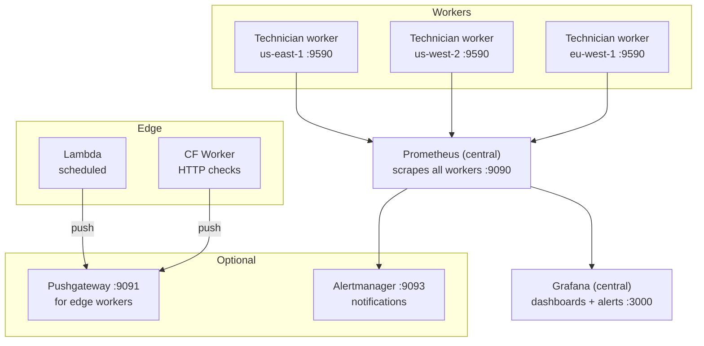
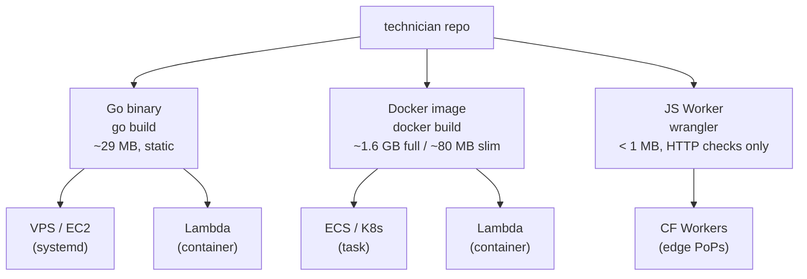
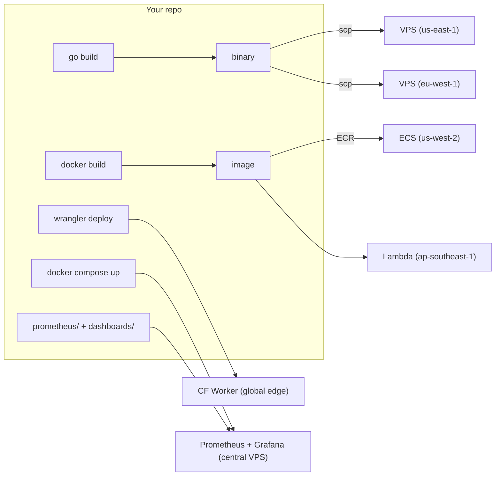

# Deployment sizing

Resource requirements, deployment topology, and scaling considerations.

## Context

Technician is a static Go binary (29 MB, stripped) with no database, no runtime interpreter, and no background job system. Checks run as goroutines inside a single process. The main variable is whether you include **Playwright browser checks**, which require Node.js and Chromium.

## Measured resource usage

Numbers below were measured with 34 checks active across a representative mix of types (6 HTTP, 3 TCP, 2 UDP, 4 DNS, 2 ICMP, 3 NTP, 4 TLS, 1 SMTP, 2 traceroute, 2 BGP, 2 domain expiry, 3 Playwright) on a Docker Compose stack.

### Runtime memory

| Component | RSS | Notes |
|-----------|-----|-------|
| Technician (Go process) | ~35 MB | 34 checks, status store, Prometheus registry |
| Prometheus | ~150 MB | 90-day retention, scraping one target |
| Grafana | ~215 MB | 6 provisioned dashboards, anonymous viewer |
| **Full stack total** | **~425 MB** | |

### Image / disk sizes

| Component | Size | Breakdown |
|-----------|------|-----------|
| Go binary | 29 MB | `CGO_ENABLED=0`, `-ldflags="-s -w"` |
| Docker image (with Playwright) | 1.63 GB | Chromium 602 MB + headless shell 323 MB + Node.js base + system deps |
| Docker image (without Playwright) | ~80 MB | Alpine or distroless base + Go binary + mtr + ca-certificates |
| Prometheus image | ~390 MB | |
| Grafana image | ~1.0 GB | |

### Playwright overhead

Each Playwright check launches a separate Chromium instance via Node.js:

| Metric | Value |
|--------|-------|
| Node.js baseline RSS | ~40 MB |
| Chromium per instance | ~150–300 MB |
| HAR + video artifacts | 1–10 MB per run (disk) |
| Cold start (first check) | ~2–3 s |
| Warm check execution | ~3–8 s depending on page complexity |

Chromium instances are not pooled — each check invocation launches and closes a browser. The `max_browsers` setting (default 2) caps concurrent instances via a semaphore. Checks queue for a slot and fail with an infra error if their timeout expires while waiting. The container **must** run an init process (e.g. `init: true` in Compose) to reap exited Chromium children — without it, zombie processes accumulate and leak kernel memory. See [Playwright scaling](playwright-scaling.md) for detailed resource projections and dedicated runner architecture.

The figures above assume `mode: local`, where Chromium runs inside the worker. In `mode: managed` the browser memory moves to the Playwright sidecar and the worker's own footprint drops to roughly the Go process plus the Node client. Budget the browser allowance against the sidecar instead, and note that the init-process requirement moves with it: Chromium children belong to the sidecar's PID 1, so the worker no longer needs `init: true` on its own account.

### TLS check overhead

The TLS check is minimal: a single outbound TCP connection + TLS handshake per check, with no subprocess or external dependency. Memory overhead is negligible (~1 KB per check run). Resource usage is comparable to a TCP check with TLS enabled.

## Performance optimizations

Technician includes several layers of optimization to minimize resource usage and maximize stability at scale.

### Network & I/O

| Optimization | Location | Detail |
|-------------|----------|--------|
| **HTTP client pooling** | `internal/check/http.go` | Shared `http.Client` per TLS/redirect config. `MaxIdleConns=100`, `MaxIdleConnsPerHost=5`, `IdleConnTimeout=90s`. Eliminates per-check TCP+TLS handshake overhead. |
| **gRPC connection pooling** | `internal/check/grpc.go` | Cached connections keyed by `(host, tls, skipTLS)`. Connections reused across check cycles. |
| **DNS resolver caching** | `internal/check/dns.go` | One `net.Resolver` per DNS server, using `PreferGo` mode with custom UDP dialer. Avoids creating a resolver per check run. |
| **Gzip response compression** | `internal/server/gzip.go` | `sync.Pool`-backed gzip middleware on all responses except `/metrics` and `/health` (which Prometheus and health checks prefer uncompressed). |
| **ETag / conditional responses** | `internal/status/handler.go` | SHA256-based ETag on `/` and `/api/status`. Returns `304 Not Modified` when content hasn't changed, saving bandwidth on the 10s auto-refresh cycle. |
| **HTTP server timeouts** | `cmd/worker.go` | `ReadTimeout=15s`, `WriteTimeout=30s`, `IdleTimeout=60s`, `MaxHeaderBytes=1MB`. Prevents slow-client resource exhaustion. |

### CPU & memory

| Optimization | Location | Detail |
|-------------|----------|--------|
| **Compiled regex cache** | `internal/check/http.go` | `sync.Map` caches compiled `*regexp.Regexp` for HTTP body/header assertions. Lock-free reads after first compile. |
| **Status snapshot caching** | `internal/status/store.go` | 2-second TTL cache on `Snapshot()`. Absorbs rapid page refreshes and the 10s auto-refresh without recomputing percentiles. |
| **Circular ring buffer** | `internal/status/store.go` | Fixed 90-entry ring per check with `head`/`full` pointer. No slice reallocation or reslicing on overflow. |
| **Template output buffering** | `internal/status/handler.go` | Status page HTML rendered to buffer before writing to `ResponseWriter`, avoiding partial writes on error. |
| **TCP read buffer limit** | `internal/check/tcp.go` | Max read size bounded to prevent memory exhaustion from large responses on banner checks. |

### Alerting stability

| Optimization | Location | Detail |
|-------------|----------|--------|
| **Check-level retries** | `internal/scheduler/scheduler.go` | Configurable `count`, `backoff` (none/linear/exponential), `delay` per check. Absorbs transient failures before reporting. |
| **Consecutive-failure threshold** | `internal/notify/notify.go` | 3 consecutive failures required before `check_down` fires. Single success resets the counter. |
| **InfraError exclusion** | `internal/notify/notify.go` | Infrastructure errors (DNS resolution, connection refused) excluded from failure counting — prevents transient infra blips from triggering alerts. |
| **Webhook concurrency limit** | `internal/notify/notify.go` | Semaphore caps outbound webhook sends at 4 concurrent goroutines. Prevents thundering herd on mass failure. |
| **Per-check cooldown** | `internal/notify/notify.go` | Deduplicates repeated notifications for the same check+event within the configured cooldown window (default 5m). |

### Prometheus & metrics

| Optimization | Location | Detail |
|-------------|----------|--------|
| **Cardinality guard** | `internal/metrics/prometheus.go` | `maxCheckCardinality` (default 500, set via `metrics.prometheus.max_check_cardinality`) — drops new check names beyond the limit, logging a warning once. Prevents label explosion from degrading Prometheus. |
| **Stagger delay** | `internal/scheduler/stagger.go` | FNV-32a hash-based deterministic delay (0–10s) per check. Spreads check execution to avoid metric spikes and network bursts. |

### Docker & CI

| Optimization | Location | Detail |
|-------------|----------|--------|
| **Multi-stage build** | `Dockerfile` | Go builder → `node:24-slim` runtime. Binary stripped (`-s -w`), CGO disabled. |
| **Layer caching** | `.github/workflows/` | Docker buildx with GitHub Actions cache. |
| **Health checks** | `docker-compose.yml` | All services (Technician, Prometheus, Alertmanager, Grafana) have health checks with start periods, enabling dependency ordering. |
| **Security scanning** | CI | `govulncheck` in CI pipeline. |

## Deployment topology

Technician is designed as a set of independent components. You can run everything on one box or spread across multiple hosts. Here's the full picture:



### Component roles

| Component | Role | Required? | Runs where |
|-----------|------|-----------|------------|
| **Technician worker** | Runs checks on a schedule, exposes `/metrics` and status page | Yes (1+ instances) | VPS, EC2, ECS, Kubernetes |
| **Prometheus** | Scrapes workers, stores time-series, evaluates alert rules | Yes (1 instance) | Central host or managed service |
| **Grafana** | Dashboards, historical views, alert notifications | Recommended (1 instance) | Central host or Grafana Cloud |
| **Alertmanager** | Routes alerts to Slack, PagerDuty, email, etc. | Optional | Alongside Prometheus |
| **Pushgateway** | Receives metrics from edge/serverless checks | Only for edge deploys | Central, reachable from edge |

### What should run together vs. separately

**Single-box deploy (development, small-scale)**

All components on one host. This is the `docker compose up` default:

- Technician worker + Prometheus + Grafana on one machine
- Fine for monitoring a handful of sites from one vantage point
- The status page at `:9590/` gives real-time view; Grafana at `:3000` gives historical

**Production deploy (multi-region)**

Separate concerns for reliability and geographic coverage:

- **Workers**: One per region/vantage point. Each runs independently with its own `ORIGIN_ID`. If a worker goes down, other regions keep probing. Workers are stateless — no data loss on restart (metrics are scraped by Prometheus before they're lost).
- **Prometheus + Grafana**: Central, on a single host or managed service. Should not run on the same box as a worker — if the worker's host dies, you lose your monitoring history.
- **Alertmanager**: Alongside Prometheus. Fires notifications when `CheckFailing` or `BudgetViolation` rules trigger.

**Why workers should be separate from the central stack:**

1. **Independence** — A worker failure shouldn't take down dashboards. A Grafana restart shouldn't stop probing.
2. **Geography** — Workers need to be in the regions you're probing from. Prometheus/Grafana only need to be reachable.
3. **Resource isolation** — Workers are tiny (~18 MB). Grafana is heavy (300 MB). Different scaling profiles.

## Build artifacts and deploy flow

One repo produces multiple deployment targets. Here's what ships where and how:



### What each target runs

| Target | Binary / image | Subcommand | Metrics flow | Status page |
|--------|---------------|------------|--------------|-------------|
| **VPS / EC2** | Go binary or Docker image | `technician worker` | Prometheus scrapes `:9590/metrics` | Built-in at `:9590/` |
| **ECS / Kubernetes** | Docker image | `technician worker` | Prometheus scrapes via service discovery | Built-in at `:9590/` |
| **Lambda (scheduled)** | Go binary (zip) or Docker image | `technician validate` or Lambda handler (planned) | Push to Pushgateway or remote-write | None (headless) |
| **Cloudflare Worker** | JS bundle (planned) | N/A (JS runtime) | Push to Pushgateway | None (headless) |

### How to deploy each target

**VPS (any provider)**

The simplest path. A single static binary, no Docker required.

```bash
# Build
CGO_ENABLED=0 go build -ldflags="-s -w" -o technician .

# Copy to server
scp technician yourserver:/usr/local/bin/
scp -r config/ yourserver:/etc/technician/

# Create data directory for status persistence
ssh yourserver 'mkdir -p /var/lib/technician'

# Run (or use systemd — see below)
ssh yourserver 'ORIGIN_ID=us-east-1 technician worker --config /etc/technician/technician.yml'
```

**What you get with just the worker (no Prometheus/Grafana):**

| Feature | Available? |
|---------|-----------|
| Status page at `:9590/` | Yes — real-time check status, history bars, latency percentiles |
| JSON API at `/api/status` | Yes — for external integrations or a custom status page |
| Prometheus metrics at `/metrics` | Yes — ready to scrape whenever you add Prometheus |
| Native webhook alerts (Discord, Slack, generic) | Yes — fires on check state transitions, cert expiry, and budget violations with severity routing (warn/crit to different channels) |
| Blackbox-exporter compat at `/probe` | Yes |
| Grafana dashboards | No — requires Prometheus + Grafana |
| Historical data beyond ~45 min | No — the in-memory ring buffer holds 90 entries per check |
| Alert rules (CheckFailing, BudgetViolation) | No — requires Prometheus |

This is a valid production deployment for teams that just need uptime monitoring with webhook alerts. The status page and `/api/status` endpoint work independently. Add Prometheus + Grafana later when you want historical trends and dashboards — the worker is already exporting metrics.

**systemd unit file:** [`deploy/systemd/technician.service`](../deploy/systemd/technician.service), hardened and ready to copy. Set `ORIGIN_ID` to match an origin in your `technician.yml`; the file also documents what to add if you want it running unprivileged.

```bash
# Install and start
sudo cp deploy/systemd/technician.service /etc/systemd/system/
sudo systemctl daemon-reload
sudo systemctl enable --now technician
sudo journalctl -u technician -f  # tail logs
```

For Playwright checks, you'd also need Node.js and Chromium on the host — in that case, Docker is easier. For traceroute checks, install mtr (`apt install mtr-tiny`) and note that mtr requires root for raw sockets (the systemd unit runs as root by default; add `AmbientCapabilities=CAP_NET_RAW` if you add a `User=` directive). For NTP checks, ensure outbound UDP port 123 is open.

**Docker / ECS / Kubernetes**

```bash
# Build image
docker build -t technician .

# Push to registry
docker tag technician your-registry/technician:latest
docker push your-registry/technician:latest

# Deploy per region (each with its own ORIGIN_ID)
# ECS: one service per region, env ORIGIN_ID=us-east-1
# K8s: one Deployment per region, env ORIGIN_ID=eu-west-1
```

Each instance runs `technician worker` (the Dockerfile default). Prometheus discovers them via DNS, ECS service discovery, or Kubernetes service endpoints.

**Lambda (planned)**

The Go binary runs in Lambda as a container image or zip deploy. Two invocation models:

1. **EventBridge schedule** triggers Lambda every N minutes. Lambda runs all checks once (`technician validate`), pushes results to Pushgateway, exits.
2. **Per-check invocation** — EventBridge triggers a separate Lambda per check. More granular, better cold-start isolation.

Lambda can't be scraped (no long-lived process), so metrics must be **pushed**:

```
EventBridge (cron) → Lambda → run checks → push to Pushgateway → Prometheus scrapes Pushgateway
```

See [Central Prometheus and Grafana](architecture/central-prometheus-grafana.md) for push configuration.

**Cloudflare Workers (planned)**

A separate JS/TS implementation under `workers/cf/` that mirrors the `/probe?target=&module=` contract. Deployed via Wrangler:

```
Cron Trigger → Worker → HTTP check → push result to Pushgateway
```

Workers run at Cloudflare's edge PoPs — you get geographic diversity without managing servers. The Worker is not the Go binary; it's a lightweight JS check that speaks the same metrics format.

See [Cloudflare Workers proposal](proposals/cloudflare-workers.md) for the full design.

### Where the control center lives

The **central dashboard** is separate from all check workers:

| Piece | What it does | Where it runs |
|-------|-------------|---------------|
| **Prometheus** | Scrapes all VPS/ECS workers. Scrapes Pushgateway for Lambda/edge results. Stores all time-series. Evaluates alert rules. | One central host — a VPS, EC2 instance, or managed Prometheus service. |
| **Grafana** | Queries Prometheus. Renders dashboards (uptime, timing, vitals, budgets). Sends alert notifications. This is the "control center." | Same host as Prometheus, or Grafana Cloud (free tier available). |
| **Pushgateway** | Receives metric pushes from Lambda and Cloudflare Workers. Prometheus scrapes it like any other target. | Same host as Prometheus (port 9091). |
| **Alertmanager** | Routes alerts from Prometheus rules to Slack, PagerDuty, email, webhooks. | Same host as Prometheus (port 9093). |

The built-in status page at each worker's `:9590/` is a **per-worker view** — it shows what that one worker sees in real time. Grafana is the aggregated view across all workers and regions. For a public-facing status page, use Grafana's anonymous viewer role or a static page that queries the Prometheus API.

### Putting it all together

A complete multi-region deployment from this repo:



All check results — from VPS workers, ECS tasks, Lambda functions, and Cloudflare Workers — end up in the same central Prometheus. Grafana queries that one Prometheus and shows everything on the same dashboards, filterable by `region` and check type.

## Using managed services

Technician is designed to work with self-hosted or managed infrastructure. Here's what's configurable today and what needs work.

### What's configurable now

| Dependency | Config field | Options |
|------------|-------------|---------|
| **OTLP tracing** | `metrics.otel.endpoint` | Any OTLP/HTTP-compatible collector — AWS X-Ray (via ADOT Collector), Datadog, Honeycomb, Jaeger, etc. The scheme selects the transport: `http://host:4318` for a plaintext local/sidecar collector, `https://host` for TLS (a bare `host:port` is treated as TLS). Leave empty to disable. |
| **Artifact storage** | `artifacts.driver` | `local` (disk), `s3` (any S3-compatible store — AWS S3, MinIO, R2), or `none`. |
| **Prometheus scrape** | `metrics.prometheus.listen` | Technician exposes `/metrics` on this address. Any Prometheus-compatible scraper can collect from it. |

### AWS Managed Prometheus (AMP)

AMP uses remote-write ingestion, not pull-based scraping. Three ways to get metrics from Technician into AMP:

**Option A: AMP managed scraper (simplest for ECS/EC2)**

A VPC-connected managed collector scrapes ECS and EC2 targets natively. For ECS it discovers tasks through AWS Cloud Map using `dns_sd_configs`, so registering the service in Cloud Map is all Technician needs to do — no sidecar, no code changes, `/metrics` as usual.

Note that it must be created via the API or CLI (`aws amp create-scraper` with `source.vpcConfiguration`). There is no CloudFormation resource for it: `AWS::APS::Scraper` accepts only `Source: EksConfiguration`. The [ECS template](../deploy/cloudformation/README.md) provisions the Cloud Map namespace the collector resolves, and documents the CLI step.

**Option B: Sidecar agent (works anywhere)**

Run Grafana Alloy, Prometheus in agent mode, or AWS Distro for OpenTelemetry (ADOT) alongside each Technician worker. The agent scrapes local `:9590/metrics` and remote-writes to AMP.

Example with Grafana Alloy:

```hcl
prometheus.scrape "technician" {
  targets    = [{"__address__" = "localhost:9590"}]
  forward_to = [prometheus.remote_write.amp.receiver]
}

prometheus.remote_write "amp" {
  endpoint {
    url = "https://aps-workspaces.us-east-1.amazonaws.com/workspaces/ws-xxx/api/v1/remote_write"
    sigv4 { region = "us-east-1" }
  }
}
```

**Option C: Built-in remote-write (planned)**

A future enhancement would add native Prometheus remote-write to Technician itself, configured via `metrics.prometheus.remote_write_url` in `technician.yml`. This eliminates the sidecar for push-based environments (Lambda, edge, or when AMP managed scraper isn't available).

### AWS Managed Grafana (AMG)

No code changes needed. Configure AMG with a Prometheus datasource pointing at your AMP workspace, then import the dashboard JSONs from `dashboards/`. The dashboards use standard PromQL and template variables (`region`, `check`, and for browser dashboards `network` and `device`) that work identically with AMP.

### Alerting

Technician supports two complementary alerting layers:

**Central alerting** — alerts evaluated by Prometheus or Grafana against scraped metrics. Supports grouping, silencing, escalation, and dashboards.

| Approach | How |
|----------|-----|
| **Prometheus alert rules** | Deploy `prometheus/rules.yml` to AMP or self-hosted Prometheus. Rules like `CheckFailing` and `BudgetViolation` fire as native Prometheus alerts. |
| **Grafana alerting** | Define alert rules in AMG/Grafana that query AMP. Route to SNS, PagerDuty, Slack, etc. via Grafana contact points. |
| **Alertmanager** | Self-hosted Alertmanager receives alerts from Prometheus rules. Routes to Slack, PagerDuty, email, webhooks. |

**Native webhooks** — webhooks fired directly from the Technician worker on check state changes (up→down, down→up) and budget violations. No dependency on the central stack being reachable.

| | Central (Prometheus/Grafana) | Native (Technician worker) |
|--|------------------------------|--------------------------|
| **Latency** | 30–60s (scrape interval + rule eval) | Immediate (fires in the check goroutine) |
| **Deduplication** | Alertmanager groups, deduplicates, silences | Fire on state change only, with per-check cooldown |
| **Dependency** | Requires Prometheus + Alertmanager/Grafana to be up | Zero — just an outbound HTTP POST |
| **Escalation** | Routes by severity, time-of-day, team | Not built-in (use central for complex routing) |
| **Works on Lambda/edge** | Only if metrics reach Prometheus in time | Yes — fires before the function exits |
| **Best for** | Alert management with grouping, silencing, escalation, history | "Check down" notifications that fire regardless of central stack health |

Native webhooks are configured in `technician.yml` under `webhooks` and support Discord, Slack, and generic HTTP endpoints. See [alerting.md](alerting.md) for configuration details and comparison of all three alerting strategies.

### Dependency map

Every external dependency Technician touches, and whether it can be swapped:

| Dependency | Bundled (docker compose) | Managed alternative | Config needed |
|------------|-------------------------|--------------------|----|
| Prometheus | `prom/prometheus` container | AMP, Grafana Cloud, Thanos, Mimir | Scrape config or remote-write agent |
| Grafana | `grafana/grafana` container | AMG, Grafana Cloud (free tier) | Datasource + dashboard import |
| Alertmanager | `prom/alertmanager` container | AMG alerting, SNS, PagerDuty via Grafana | `prometheus/alertmanager.yml` receivers; or contact point config in Grafana |
| Artifact storage | Local disk (`/tmp/technician/artifacts`) | S3, R2, MinIO | `artifacts.driver: s3` + bucket/region |
| OTLP tracing | None (disabled by default) | X-Ray (ADOT), Datadog, Honeycomb | `metrics.otel.endpoint` |
| DNS/network | Host resolver | Route 53, Cloudflare DNS | N/A (uses OS resolver) |

## Persistence and historical data

Moved to [persistence and retention](persistence-and-retention.md): storage model,
Prometheus storage safeguards, status store scaling, metrics cardinality, and how
to get 30-day uptime without an application database.

## Check schedule guidance

Not all checks need the same frequency. Shorter intervals increase request volume, Prometheus series churn, and load on third-party targets. Recommended intervals by check category:

| Category | Interval | Rationale |
|----------|----------|-----------|
| Your own services (HTTP, gRPC) | 30s–1min | These are your SLA. Fast detection matters. |
| Infrastructure connectivity (TCP, ICMP, UDP) | 2min | Detects outages within minutes. 60s is unnecessary for connectivity checks. |
| DNS resolution | 5min | DNS records change infrequently and are cached upstream. |
| Third-party APIs | 5min | Be respectful of services you don't control. Higher frequency risks rate limiting. |
| NTP | 10min | Clock drift is slow. More frequent checks add no value. |
| BGP, SMTP | 15min | Route changes and mail server state are slow-moving. |
| Traceroute | 30min | Expensive (spawns mtr subprocess). Path changes are infrequent. |
| TLS certificates, domain expiry | 6h | Certificates don't expire between checks. Daily or 6h is sufficient. |

A typical production deployment with 30 checks using the intervals above generates ~350 requests/hour — well within the capacity of a single worker and comfortable for third-party targets.

## Sizing by deployment mode

### Checks only, no Playwright

The lightest deployment. Just the Go binary running HTTP, TCP, DNS, ICMP, gRPC, NTP, TLS, SMTP, and/or traceroute checks.

| Resource | Minimum | Notes |
|----------|---------|-------|
| CPU | 1 vCPU (shared OK) | Checks are I/O-bound, not CPU-bound |
| RAM | 128 MB | Go binary + headroom |
| Disk | 50 MB | Binary + config + mtr |

This fits on a $2.50–5/mo VPS from any provider. Also fine as a sidecar container in ECS/Kubernetes.

### Checks with Playwright

Add browser checks for Core Web Vitals (LCP, INP, CLS) and visual testing.

| Resource | Minimum | Recommended |
|----------|---------|-------------|
| CPU | 1 vCPU | 2 vCPU |
| RAM | 512 MB | 1 GB |
| Disk | 2 GB | 3 GB (if saving video artifacts) |

The RAM floor depends on concurrency. One Playwright check at a time: 512 MB is fine. If you schedule overlapping browser checks or have short intervals, budget 1 GB. Video recording adds disk I/O but minimal RAM.

### Full stack, single box

Everything on one host — good for a single VPS or self-contained monitoring instance.

| Resource | Minimum | Recommended |
|----------|---------|-------------|
| CPU | 1 vCPU | 2 vCPU |
| RAM | 1 GB (no Playwright) | 2 GB (with Playwright) |
| Disk | 5 GB | 10 GB (90d Prometheus retention + Grafana + artifacts) |

A VPS in the $4–12/mo range handles this comfortably without Playwright. Grafana is the heaviest image (~1.0 GB); Technician is the heaviest process (~500 MB RSS with Playwright idle). If you use hosted Grafana (Grafana Cloud, etc.), drop it from the stack and save ~1 GB of image + ~215 MB of RAM.

#### Per-container memory budget (Docker Compose)

The default `docker-compose.yml` ships with `deploy.resources` set on each service so a runaway browser instance can't pressure the rest of the stack. Reservations are soft floors honored under contention; limits are hard ceilings enforced by the kernel.

| Container | Reservation | Limit | Why |
|---|---|---|---|
| technician | 512 MB | 1 GB | Go process (~18 MB) + up to 2 concurrent Chromium (~300 MB each); peak ~505 MB observed under three concurrent browser checks |
| prometheus | 256 MB | 512 MB | ~145 MB observed at 90-day retention; headroom for query bursts |
| grafana | 768 MB | 1 GB | p50 ~560 MB / p90 ~712 MB observed during dashboard activity; reservation covers steady state, limit absorbs transient peaks |
| alertmanager | 64 MB | 128 MB | ~49 MB observed |

Sum: ~1.6 GB reserved, ~2.6 GB ceiling. Fits inside the 2 GB recommended host RAM under normal load, with the limits absorbing transient spikes (Chromium launches, Grafana dashboard renders, Prometheus query fan-out) before the OOM killer would fire.

To run with tighter host RAM (e.g. 1 GB box, no Playwright), drop the technician limit to 256 MB and disable browser checks in your config — the reservations on the other services already total ~1.1 GB.

### Full spread, multi-region

The "all in" deployment: one Technician worker per region, one central Prometheus + Grafana instance. Each worker is independently provisioned — providers can be mixed freely since Prometheus just scrapes each worker's public IP.

| Component | Instances | Specs each |
|-----------|-----------|------------|
| Technician worker (no Playwright) | 1 per region | 1 vCPU, 256 MB, 1 GB disk |
| Technician worker (with Playwright) | 1 per region | 1 vCPU, 1 GB, 3 GB disk |
| Prometheus + Alertmanager + Grafana | 1 central | 2 vCPU, 2 GB, 20 GB disk |
| Pushgateway (if using edge workers) | 1 central | Collocate with Prometheus |

### VPS providers

The providers below all have official Terraform providers, proper APIs, and strong reliability reputations. All run the Docker Compose stack without modification — SSH in, clone the repo, `docker compose up -d`. Pick by coverage needed:

| Provider | Regions | Worker (no PW) | Worker (PW) | Full stack | Best for |
|----------|---------|----------------|-------------|------------|----------|
| **Hetzner** | US (2), EU (3), SG | ~$4/mo | ~$9/mo | ~$4–17/mo | Best value; US + EU coverage |
| **Linode/Akamai** | US, EU, JP, SG, IN, AU (11+, expanding) | ~$5/mo | ~$12/mo | ~$12–48/mo | US + EU + Asia-Pacific |
| **Vultr** | 32 cities, 19 countries | ~$5/mo | ~$12/mo | ~$10–48/mo | True global (LATAM, Africa, Middle East) |
| **DigitalOcean** | US, EU, SG, AU, IN (10) | ~$6/mo | ~$12/mo | ~$12–48/mo | Best docs and ecosystem |

Hetzner ARM instances (CAX series) are EU-only but their x86 plans (CX series) are available in the US. Vultr is the only provider with coverage in South America, Africa, and the Middle East.

**Example: 3-region deployment (Playwright, self-hosted Grafana)**

| Coverage | Provider | Workers (3×) | Central stack | Total |
|----------|----------|-------------|---------------|-------|
| US + EU | Hetzner | 3 × ~$5 | ~$9 | **~$24/mo** |
| US + EU + APAC | Linode | 3 × ~$12 | ~$12 | **~$48/mo** |
| Global (5+ continents) | Vultr | 3 × ~$12 | ~$12 | **~$48/mo** |
| Cost-optimized global | Hetzner (US/EU) + Vultr (APAC) | 2 × $5 + 1 × $12 | ~$9 | **~$31/mo** |

For HTTP-only checks without Playwright, halve the worker costs. Using Grafana Cloud (free tier) instead of self-hosted saves ~$4–6/mo on the central stack.

**S3-compatible object storage (for `artifacts.driver: s3`)**

| Provider | Price | Egress | Notes |
|----------|-------|--------|-------|
| Cloudflare R2 | $0.015/GB/mo | Free | Works from any provider |
| Hetzner | ~$5.40/mo (1 TB incl.) | EUR 1/TB | |
| DigitalOcean Spaces | $5/mo (250 GB incl.) | $0.01/GB | CDN included |
| Linode | $5/mo (250 GB incl.) | $0.005/GB | |
| Vultr | $5/mo (250 GB incl.) | $0.01/GB | |

**AWS** — The same stack on AWS (ECS Fargate) costs 4–6x more due to managed-service overhead. See `examples/cloudformation/` for pre-built templates if AWS is a requirement.

### AWS Lambda

Lambda runs checks on demand (EventBridge schedule → Lambda invocation → push metrics).

| Config | Function memory | Timeout | Image |
|--------|-----------------|---------|-------|
| HTTP/SMTP only | 128 MB | 30 s | Go binary (zip deploy, ~10 MB) |
| With Playwright | 512 MB–1 GB | 60 s | Container image (Lambda container, ~1.6 GB) |

Lambda cold starts: ~100 ms for the Go binary, ~3–5 s with Playwright/Chromium. Use provisioned concurrency if cold start matters.

No `/metrics` endpoint on Lambda — push results to a Pushgateway or remote-write endpoint. See [Central Prometheus and Grafana](architecture/central-prometheus-grafana.md).

### Cloudflare Workers

JS/TS-only HTTP checks (no Go binary, no Playwright). See [Cloudflare Workers proposal](proposals/cloudflare-workers.md).

| Resource | Limit |
|----------|-------|
| CPU time | 10–50 ms per invocation (Workers free/paid) |
| RAM | 128 MB |
| Deploy size | < 1 MB (JS bundle) |

Workers run at the edge with no cold start. Suited for HTTP uptime checks from many PoPs.

## Firewall rules

| Port | Protocol | Direction | Purpose |
|------|----------|-----------|---------|
| 9590 | TCP | Inbound | Technician status page, `/metrics`, `/probe` |
| 9090 | TCP | Inbound | Prometheus UI (if running full stack) |
| 3000 | TCP | Inbound | Grafana UI (if running full stack) |
| 25 | TCP | Outbound | SMTP checks (if used) |
| 123 | UDP | Outbound | NTP checks (if used) |
| 443 | TCP | Outbound | HTTPS checks + Playwright CDN fetches |

SMTP checks need outbound port 25, which most cloud vendors firewall by default. You'll need to submit a support request to have it opened before SMTP checks will work.
