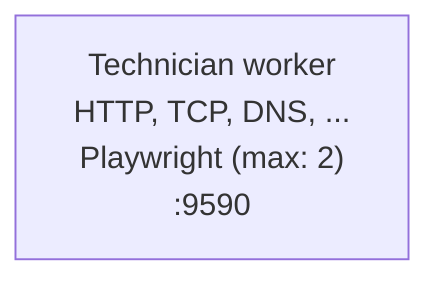
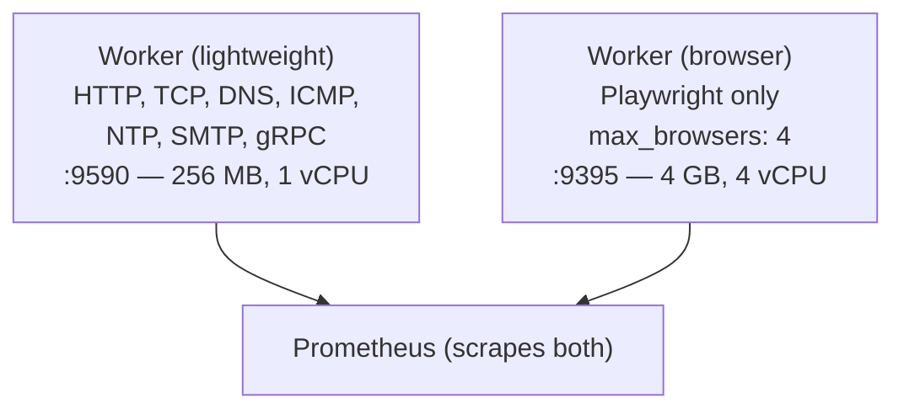
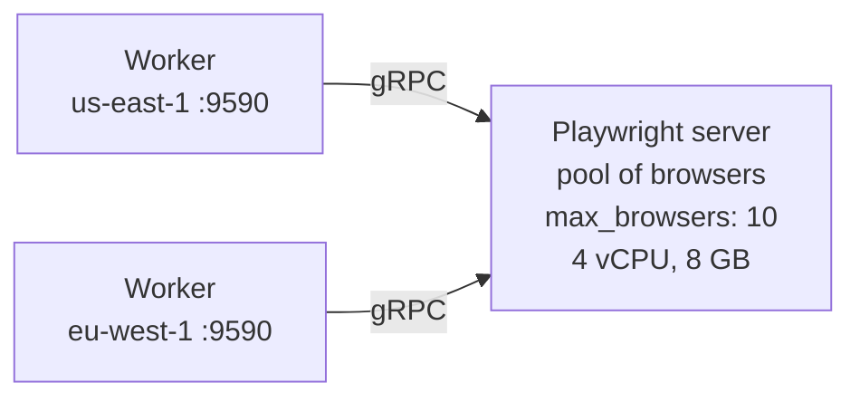

# Playwright scaling

Resource analysis, concurrency controls, and architecture for scaling browser checks.

## Current resource profile

Numbers measured with 3 Playwright checks (desktop, mobile 4G, mobile 3G) at 5-minute intervals on a Docker Compose stack.

### Per-instance costs

| Resource | Value |
|----------|-------|
| Node.js baseline RSS | ~40 MB |
| Chromium per instance | 150-300 MB (depends on page complexity) |
| HAR per run | 1-10 MB (disk) |
| Video per run | 1-10 MB (disk, when enabled) |
| Cold start (first check) | ~2-3 s |
| Warm check execution | 3-8 s |
| Web Vitals collection | up to 3 s per metric |

### Docker image impact

| | With Playwright | Without Playwright |
|--|-----------------|-------------------|
| Docker image size | 1.62 GB | ~80 MB |
| Chromium | 602 MB | - |
| Headless shell | 323 MB | - |
| Node.js + system deps | ~700 MB | - |
| Go binary | ~30 MB | ~30 MB |

The image size is fixed regardless of check count -- Chromium is installed once.

## Scaling by check count

Each Playwright check invocation launches a fresh Chromium instance. There is no browser pooling -- `run.js` calls `chromium.launch()` every time, and the Go process spawns a new `node` subprocess per run.

> **Init process required.** Because each check spawns Node.js → Chromium child processes, the container must run an init system (e.g. `tini`) as PID 1 to reap exited children. Without it, terminated Chromium processes accumulate as zombies, consuming kernel memory that grows linearly with check runs. In Docker Compose, add `init: true` to the service. In Kubernetes, set `shareProcessNamespace: true` or use a `tini` entrypoint. In ECS, enable `initProcessEnabled` in the container definition.

The `max_browsers` setting in `technician.yml` caps concurrent Chromium instances using a channel-based semaphore. Additional checks queue until a slot opens or their timeout expires.

```yaml
playwright:
  mode: local
  max_browsers: 2  # default; increase for dedicated runner hosts
```

### Projected resource usage

| Scenario | Peak concurrent browsers | RAM ceiling | Disk (artifacts/day) |
|----------|-------------------------|-------------|---------------------|
| 3 checks @ 5 min (current) | 1 | ~350 MB | ~2 GB |
| 10 checks @ 5 min | 1-2 | ~600 MB | ~7 GB |
| 10 checks @ 1 min | 2-4 | ~1.2 GB | ~35 GB |
| 20 checks @ 1 min | 4-8 | ~2.4 GB | ~70 GB |
| CI validate (all at once) | N simultaneous | ~300 MB x N | negligible |

### The three cost drivers

**1. RAM -- concurrent Chromium instances.** Each browser is 150-300 MB depending on page complexity. The `max_browsers` semaphore prevents unbounded stacking. If a check can't acquire a slot within its timeout, it fails with an infra error rather than OOM-killing the host.

**2. Disk -- HAR + video are transient.** With `video: true` and full HAR recording, each run produces 2-20 MB of scratch output, written to a unique per-run temp directory and deleted when the run finishes — concurrent runs never share paths, and nothing accumulates between runs. Peak disk usage is bounded by `max_browsers` × per-run size. Videos are not yet retained anywhere; routing them through the artifact store for failure inspection is tracked separately.

**3. CPU -- Chromium rendering.** Each instance uses 1-2 CPU cores during page load. 4+ concurrent browsers will saturate a 2-vCPU host. Complex flows with interactions, screenshots, and Web Vitals collection extend the CPU-busy window.

### What doesn't change

- **Docker image size** stays ~1.62 GB regardless of check count
- **Go process RSS** stays ~18 MB -- it just shells out to Node
- **Network** is negligible unless testing bandwidth-heavy pages with video recording

## Concurrency control

The `max_browsers` config field controls how many Chromium instances can run simultaneously across all Playwright checks on a single worker. This is enforced by a channel-based semaphore in `PlaywrightChecker`.

When all slots are occupied:
- New checks wait for a slot to open
- If the check's timeout expires while waiting, it returns an infra error: `timed out waiting for browser slot (N/N in use)`
- The check is logged as a warning so you can tune `max_browsers` or adjust schedules

### Recommended settings

| Environment | `max_browsers` | Why |
|-------------|---------------|-----|
| VPS, 1 vCPU, 1 GB | 1 | Serializes all browser checks; prevents OOM |
| VPS, 2 vCPU, 2 GB | 2 (default) | Two concurrent browsers fit comfortably |
| Dedicated runner, 4 vCPU, 4 GB | 4 | One browser per core |
| CI (GitHub Actions, 7 GB) | 3-4 | Balance parallelism with shared runner limits |
| CI (2 GB runner) | 1 | Serialize to avoid OOM |

### Tuning

If you see `timed out waiting for browser slot` in logs:
1. **Increase `max_browsers`** if the host has RAM headroom
2. **Spread schedules** -- offset cron expressions so browser checks don't all fire on the same tick. The built-in per-check stagger only smears them across ~10s, which is not enough when a throttled flow holds a browser for tens of seconds. Give each browser check its own minute with 6-field range-step cron, e.g. `0 */5 * * * *` (minutes 0,5,10…), `0 2-59/5 * * * *` (2,7,12…), `0 4-59/5 * * * *` (4,9,14…)
3. **Increase check timeout** -- give more time to wait for a slot
4. **Move browser checks to a dedicated runner** (see below)

## CI usage

### Resource limits by CI platform

| CI runner | RAM | Comfortable `max_browsers` |
|-----------|-----|---------------------------|
| GitHub Actions (standard) | 7 GB, 2 CPU | 3-4 |
| GitHub Actions (large) | 16-64 GB, 4-16 CPU | 6-10 |
| GitLab CI (shared) | 4 GB | 2 |
| CircleCI (medium) | 4 GB | 2 |
| Jenkins (varies) | host-dependent | host-dependent |
| 2 GB runner (any) | 2 GB | 1 |

### GitHub Actions

The `technician validate` command runs all checks once and evaluates performance budgets. Use it in CI to catch regressions:

```yaml
- name: Validate checks + budgets
  run: technician validate --config config/technician.yml --budget config/budgets.yml --output gha
```

The `--output gha` flag emits GitHub Actions annotations for budget violations, which appear inline on the PR diff.

For Playwright checks in CI, either:
- Use the pre-built Docker image (includes Chromium): `container: ghcr.io/your-org/technician:latest`
- Or install Playwright in the job: `npx playwright install chromium`

See `.github/workflows/ci.yml` for a complete example.

### Generic CI

For any CI platform, the pattern is the same:

```bash
# Build
go build -o technician .

# Run all checks and check budgets
./technician validate --config config/technician.yml --budget config/budgets.yml --output json

# Exit code: 0 = pass, 1 = violations
```

Output formats:
- `text` -- human-readable summary
- `json` -- machine-parseable results (pipe to `jq` or your reporting tool)
- `gha` -- GitHub Actions annotations

## Architecture: dedicated Playwright runners

As Playwright check count grows, you'll want to separate browser checks from lightweight checks (HTTP, TCP, DNS, etc.). Here's the progression:

### Stage 1: Single worker (current)

All checks on one host. `max_browsers` prevents OOM.



### Stage 2: Dedicated browser worker

Split into two workers at the same site. One runs lightweight checks, the other runs only Playwright checks with more resources.



This already works today with separate config directories:

```bash
# Lightweight worker (no Playwright checks in its config)
technician worker --config /etc/technician/light/technician.yml --origin us-east-1

# Browser worker (only Playwright checks in its config)
technician worker --config /etc/technician/browser/technician.yml --origin us-east-1
```

Prometheus scrapes both on different ports. Grafana sees all metrics with the same `region` label.

### Stage 3: Remote browser service

Implemented. A dedicated Playwright server that workers connect to over the network, instead of each worker launching its own Chromium:



```yaml
playwright:
  mode: managed                        # "local" (default) or "managed"
  server_url: "ws://playwright:3000/"  # required when mode is managed
  max_browsers: 10
```

In `managed` mode the runner calls `chromium.connect(server_url)` instead of `chromium.launch()`. Everything downstream (device emulation, network throttling, HAR capture, Web Vitals) is unchanged, since it all operates on the context and page rather than on how the browser started. `max_browsers` still applies locally, bounding how many concurrent sessions this worker opens against the server.

The server is the **stock upstream Playwright image**, driven by a command the same way Prometheus and Grafana are in the base stack. Nothing forks or patches Playwright, and the technician image no longer has to own a browser. Run it with the overlay:

```bash
docker compose -f docker-compose.yml -f docker-compose.playwright.yml up -d
```

**Version pinning is required, not optional.** The sidecar image tag and the playwright version embedded in the binary (`internal/playwright/scripts/package.json`) must agree. A mismatched client and server fail the handshake, and it surfaces as a setup-stage infra error on every browser check rather than a clear version message. Bump both together.

**When to move to managed mode:**
- 10+ Playwright checks per region
- Multiple workers sharing the same browser pool
- Browser checks are the bottleneck and you want to scale them independently
- You want the browser to be a standard upstream artifact you can patch on its own cadence, or to run an engine other than Chromium

### Stage 4: Ephemeral browsers (future)

For cloud-native deployments, each browser check spawns an ephemeral container:


This scales to hundreds of concurrent browsers with no long-running infrastructure. The trade-off is cold-start latency (~3-5s for Chromium in a container).

## Recommendations by scale

| Playwright checks | Architecture | `max_browsers` | Host specs |
|-------------------|-------------|---------------|------------|
| 1-5 | Single worker (Stage 1) | 2 | 2 vCPU, 1-2 GB |
| 5-15 | Dedicated browser worker (Stage 2) | 4 | 4 vCPU, 4 GB (browser worker) |
| 15-50 | Remote browser service (Stage 3) | 10+ | 8 vCPU, 8 GB (browser server) |
| 50+ | Ephemeral browsers (Stage 4) | unlimited | Cloud auto-scaling |

## Browser reuse (planned optimization)

Currently each check invocation launches and closes a fresh Chromium instance. A future optimization would maintain a browser pool:

1. Launch N Chromium instances at startup
2. Each check gets a fresh `BrowserContext` (isolated cookies, storage) from the pool
3. Contexts are destroyed after each check; browsers persist
4. Eliminates the 2-3s cold-start per check

This reduces per-check overhead from ~40 MB (Node.js) + 150-300 MB (Chromium launch) to just a new context (~10-20 MB). It's the logical next step before moving to managed mode.
